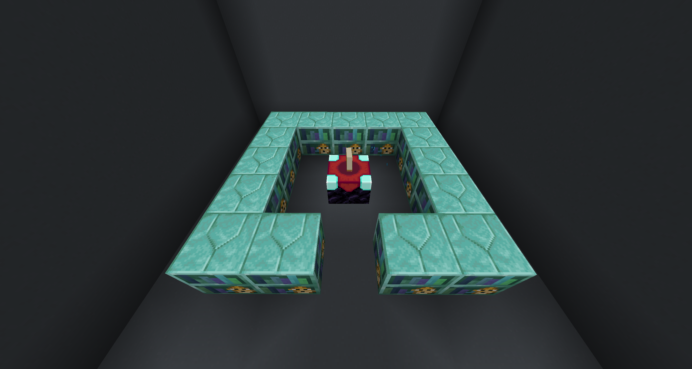
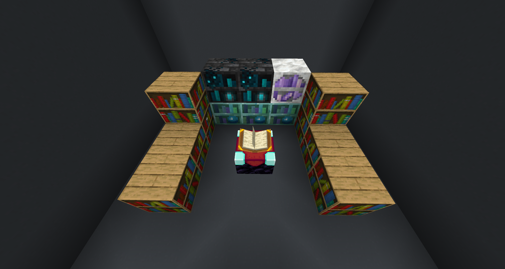
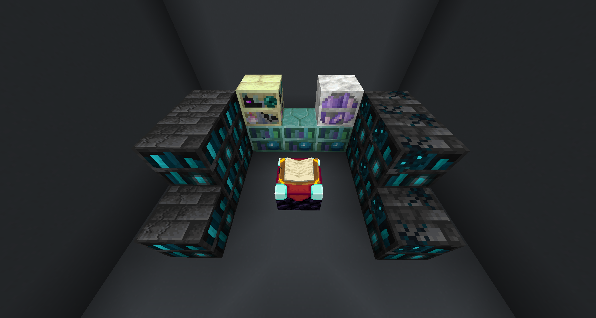
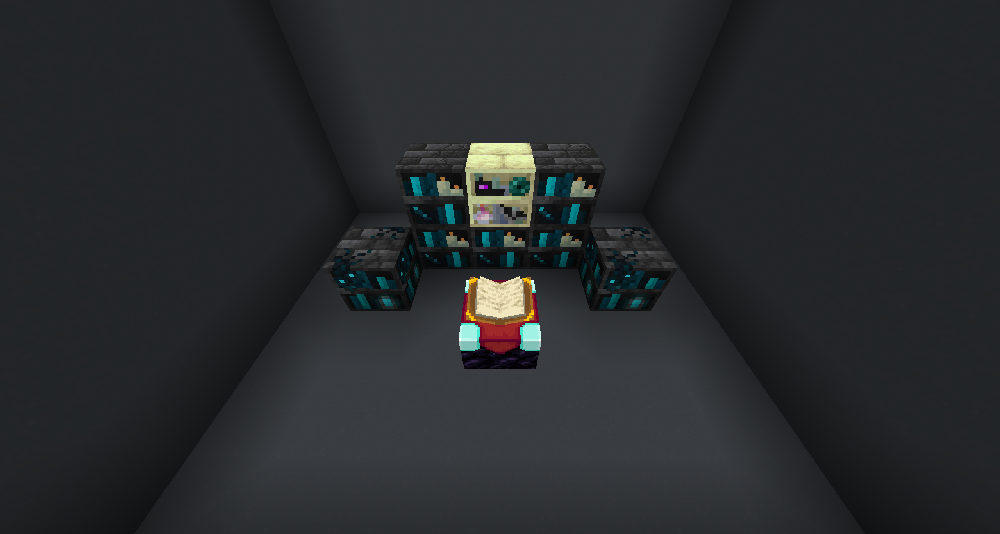
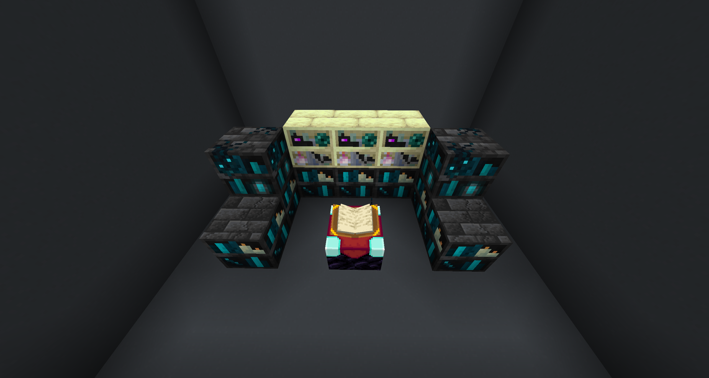
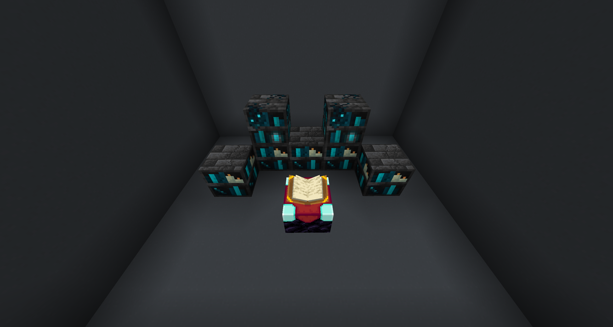

# Apothic Enchanting

## Max Enchanting Setup

??? information "Max Enchanting Shelves List"
	- [ ] 5x Soul-Touched Sculkshelf
	- [ ] 5x Soul-Touched Deepshelf
	- [ ] 3x Heart-Forged Seashelf
	- [ ] 1x Draconic Endshelf
	- [ ] 1x Geode-Encased Bookcase of Stability

Craft 16x **Seashelf** and place all but one in the usual enchanting configuration.  

{.center}

Now take your last Seashelf and **infuse it**. You should see an infusion option for 3 EXP. Now replace one of the uninfused **Seashelf** with your **Infused Seashelf**. Repeat this until all 16 `Seashelf` are `Infused Seashelf`. You will have one extra `Infused Seashelf`.

!!! info "You must be level 45+ to infuse Seashelves"

---

After all of shelves are infused, you'll need to break 12x Infused Seashelf and craft 3x **Heart-Forged Seashelf** and 9x **Crystalline Seashelf**. After you're done crafting them, place them down.

Now craft 10x **Dormant Deepshelf** and infuse them into their **Deepshelf** varient.

!!! info "You must be level 60+ to infuse Dormant Deepshelves"

---

After infusing all 10 dormant deepshelves, use them to craft 5x **Soul-Touched Deepshelf** and 5x **Echoing Deepshelf**. Then upgrade them to their **Sculkshelf** variant. *Remember to use EMI to see the recipes.* 

Now you need to craft 1x **Geode-Encased Bookcase of Stability**. 

You can infuse a **Block of Amethyst** to get **Budding Amethyst**. Place 3x **Heart-Forged Seashelf** and 2x **Soul-Touched Deepshelf** to infuse it.

!!! info "You must be level 65+ to infuse Block of Amethyst"

{.center}

---

Now craft 1x **Draconic Endshelf**. To make **Infused Dragon's Breath**, place down 

!!! abstract ""
	- 2x **Soul-Touched Sculkshelf**
	- 3x **Heart-Forged Seashelf**
	- 8x **Normal Bookshelf**
	- 1x **Geode-Encased Bookcase of Stability**

!!! info "You must be level 80+ to infuse Dragon's Breath"

---

After making the **Draconic Endshelf**, place your crafted shelves for max enchants!

!!! example ""
	- 5x **Soul-Touched Sculkshelf**
	- 5x **Soul-Touched Deepshelf**
	- 3x **Heart-Forged Seashelf**
	- 1x **Draconic Endshelf**
	- 1x **Geode-Encased Bookcase of Stability**

{.center}

---

### Treasure Enchants

To get treasure enchants place 1x **Deepshelf of Arcane Treasures** and 4x **Candles**.
	
You can use **Seashelf of Aquatic Filtration** to filter out enchants you don't want such as curses.

---

## Infusion Setups

You do not have to place the blocks exactly as I do, these are just an example.

### Tome of Superior Scrapping

Same setup as [Tome of Extraction](#tome-of-extraction)

!!! info "3x Echoing Deepshelf, 1x Soul-Touched Deepshelf, 1x Endshelf, 1x Draconic Endshelf"

{.center}

### Tome of Extraction

Same setup as [Tome of Superior Scrapping](#tome-of-superior-scrapping)

!!! info "3x Echoing Deepshelf, 1x Soul-Touched Deepshelf, 1x Endshelf, 1x Draconic Endshelf"

{.center}

### Library of Alexandria

!!! info "7x Echoing Deepshelf, 3x Draconic Endshelf, 2x Soul-Touched Deepshelf"

{.center}

### Trident

!!! info "5x Echoing Deepshelf, 2x Soul-Touched Deepshelf"

{.center}

> Apothic Enchanting | [CurseForge](https://legacy.curseforge.com/minecraft/mc-mods/apothic-enchanting)
