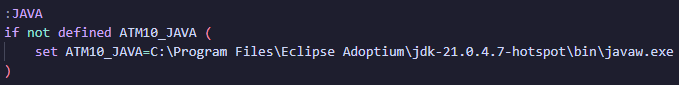

# Server

This guide will explain how to setup an AllTheMods server locally, or with a server host.

---

## Prerequisites

- [x] Server with at least **8GB+** of RAM (*As required for most ATM packs*).
- [x] CPU with at least **3.5Ghz**.
- [x] The specific [Java](../java.md) version based on the pack's **Minecraft** version.

---

## Installation

- Go to the **Curseforge** Page of the modpack
- Click on **Files** and chose the version you want to play on
- Scroll down and click on **Additional Files**
- Scroll down again and download the **Server Files**
- Go to your **Download** Folder and extract the **Server-Files.zip** to a folder.

!!! Warning "If you've a 3rd party Anti-Virus installed, exclude the folder the files will be extracted too, as files may get remove or corrupted after extracting."

---

### Java

If you have **multiple** [Java](../java.md) versions installed, the default `java -version` will be used, which may not be the correct version based on the **Minecraft** version. Either of these solutions will work, you do not have to do all of them.

If you only have **one** [Java](../java.md) version installed, you do not have to specify a **Java Path** or **System Environmental Variable**, but specifying the path anyway will ensure you won't break anything if you ever decide to install another version of java

1. Simply uninstall all [Java](../java.md) versions except the one being used.
2. Edit the `startserver` file and change `java` to the desired install-location
    - Ex: `C:\Program Files\Eclipse Adoptium\jdk-21.0.4.7-hotspot\bin\java.exe`
    
3. Look for **System Environmental Variable** in your Windows Search bar
    - Under the Tab **Advanced**, click on **Environmental Variables**
    - Under **System Variables**, choose **new**
    - Name it as specified at the top in the **startserver** file (Ex: **ATM10_Java**)
    - Set **Value** as the install-location of the desired Java version
4. On **Linux**, you can re-configure [Java](../java.md) using `sudo update-alternatives --config java`


!!! Note "If you've just installed [Java](../java.md), you may need to restart your OS."

---

### Local Installation

- Extract **Server-Files** to a folder.
- **Window**: Do not unzip files under **OneDrive** or any other cloud folder, as this can potentially remove / corrupt files.
- **Linux**: Ensure server folder has read/write permission, and script has execute permission,
    - To avoid any _read/write_ permission errors, install server under `/home/<user>/` folder.
    - Run once: `sudo chmod +x startserver.sh`.
- Starting Server:
    - **Windows**: Execute `startserver.bat`
    - **Linux**: Execute `./startserver.sh`

The first time you tun `startserver` it will generate a bunch of files. **Do not end the installer during this**. If you do so, you might have to start over

After running `serverstart` once, you're required to accept the [Minecraft Eula](https://www.minecraft.net/en-us/eula) in the `eula.txt` file that was automatically generated, by setting `eula=true`

Make any changes necessary to `server.properties`, `configs`, and or `world/serverconfigs`, and run `startserver.bat/sh` again to start the server.

Once it says **Dedicated server took xx seconds to load** you're good to go and can join the server

???+ Warning
    Many guides tell you to edit `server-ip` or `server-port`. In most cases you **DO NOT** need to edit these, especially `server-ip`. This can prevent your server from starting.

??? Note "There's no `startserver.bat/sh` script?"
    Install **Forge** first,

    - `java -jar forge-installer*.jar --installServer`
    - You will then instead `run.bat/sh` to start server.

    ??? Tip "There's no `run.bat/sh`?"
        Expecting this is an older Forge version, you'll need to create a script that launches Forge.
        ``` title='run.bat/sh'
        java -Xms4G -Xmx8G -jar forge-*universal.jar
        ```

??? Note "How to add Arguments?"
    To add [Arguments](../java.md/#java-arguments) set them within the `usr_jvm_args.txt` file. Older versions of **Forge** will require adding arguments in the script file, if that file doesn't exist.

??? Note "How to add Ram?"
    Edit the `-Xms` (Startup Ram) and `-Xmx` (Maximum Ram) within the `usr_jvm_args.txt` file

??? Note "How To Import A World?"
    Upload world folder to server folder. Make sure the world folder is named `world`.

!!! Tip "Performance Tips: Check out [Lag / Profiling](../lag.md)"

---

### Server Host Installation

Most server host has a one-click server installer you can use, otherwise

- If possible, setup a fresh **Forge** server based on the current **Forge** version of the pack.
    - If host has no **Forge** installer, read [Server Host Custom Jar](#server-host-custom-jar)
- Upload extracted **Server-Files** to host, via **FTP** or **STFP**.
    - To connect to **FTP**/**SFTP**, you could use a client like [FileZilla](https://filezilla-project.org/).
    - If there's no **FTP**/**SFTP**, you may be able to upload the **Server-Files** zip, and extract on server host via their online **File Manager**.


---

## Server Host Custom Jar

If server host requires a `.jar` file, later **Forge** versions cannot be ran directly. If older, you can upload and use the `forge-*universal.jar` as custom jar. Extract & Upload **Server-Files** to main server folder. **Otherwise**,

- Download [ServerStarter](https://github.com/BloodyMods/ServerStarter/releases) jar, then upload to main server folder. Use this as the custom jar.
	- Use [neoforged/ServerStarterJar](https://github.com/neoforged/ServerStarterJar) for NeoForge and Forge 1.17 and earlier.
- Download pack **Server-Files** from **CurseForge**, extract, and upload **ALL** to main server folder.
- Create a file named `server-setup-config.yaml`, and copy / paste the config example below.

Modifiy config for pack if necessary, specifically the `mcVersion` and `loaderVersion`, and place config in server root then start server as normal.

??? Info "Config Example | ATM9"

    **Highlighted lines are important to be configured**

    ```yaml title='server-setup-config.yaml' hl_lines="4 5 7 8 30"
    # Version of the specs, only for internal usage if this format should ever change drastically
    _specver: 2
    modpack:
        name: ATM9
        description: All The Mods 9
    install:
        mcVersion: 1.20.1
        loaderVersion: 47.3.7
        installerUrl: "https://files.minecraftforge.net/maven/net/minecraftforge/forge/{{@mcversion@}}-{{@loaderversion@}}/forge-{{@mcversion@}}-{{@loaderversion@}}-installer.jar"
        installerArguments:
            - "--installServer"
        modpackFormat: zip
        baseInstallPath: ~
        checkFolder: true
        installLoader: true
        connectTimeout: 30
        readTimeout: 30
    launch:
        crashLimit: 10
        maxRam: 8
        minRam: 4
        crashTimer: 60min
        preJavaArgs: ~
        startFile: "forge-{{@mcversion@}}-{{@loaderversion@}}.jar"
        startCommand:
            - "@user_jvm_args.txt"
            - "@libraries/net/minecraftforge/forge/{{@mcversion@}}-{{@loaderversion@}}/{{@os@}}_args.txt"
            - "nogui"
        forcedJavaPath: ~
        supportedJavaVersions: [17]
    ```

    - `mcVersion`: Minecraft Version
    - `loaderVersion`: Forge Version
    - `supportedJavaVersions`: Supported Java Version(s)

---

## Updating

Updating ATM servers is pretty simple. There's 3 ways you can accomplish this.

!!! Danger "**BACKUP** world before proceeding."

### **Automatic**

1. If you have a server host with a modpack installer, usually you can do a one-click update within your control panel.

### **Manually** (2 methods)

1. Backup any modified configs or kubejs scripts, _if any_, to be replaced later.
    - Download **Server Files** from **CurseForge**
    - Delete `kubejs`, `defaultconfigs`, `mods`, and `config` folder.
    - If server forge version is different, delete `libraries` folder, and copy over new `startserver.bat/sh`, & `forge-installer.jar` _if exists_.
    - Extract the deleted folders from **Server Files** into your server folder.

2. Download **Server Files** from **CurseForge**.
    - Extract **Server Files** to a new folder.
    - Copy `world`, `local` folder, `server.properties`, & `eula.txt` to new server folder.
    - If `journeymap` folder exist, copy over aswell.
    - _Copy over any modified server configs/kubejs scripts_

---

> All The Mods | [GitHub](https://github.com/AllTheMods) | [Discord](https://discord.com/invite/allthemods) | [Akliz Server Hosting](https://www.akliz.net/allthemods)
