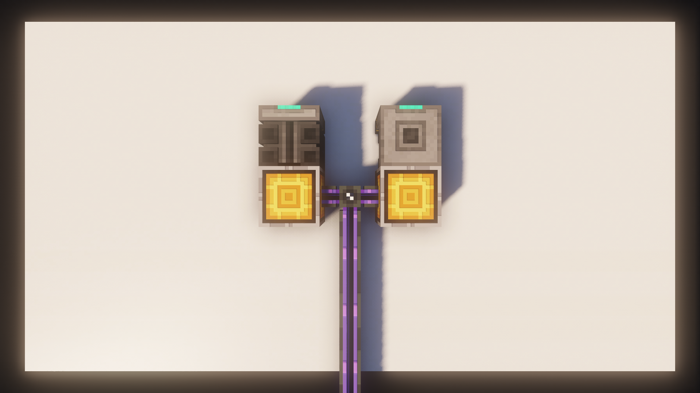
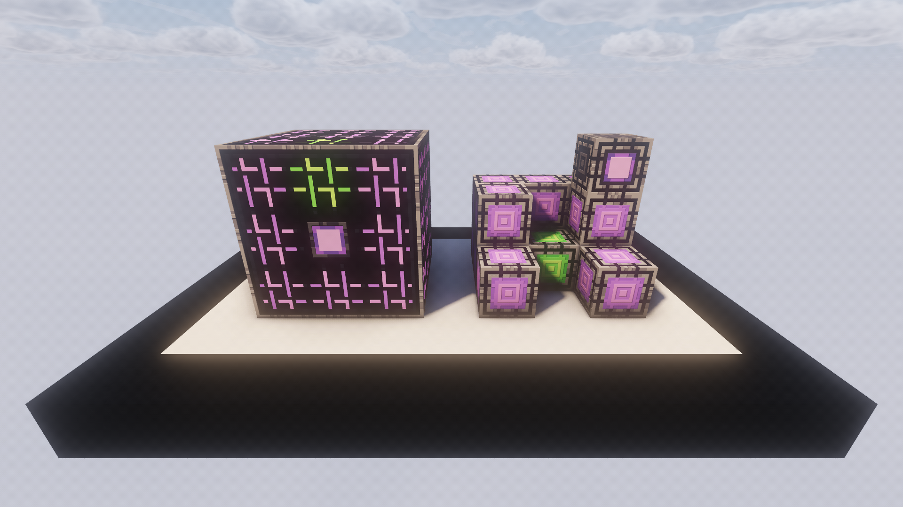

# Autocrafting

Probably *the* thing your ME System is supposed to do for you is taking all that nasty crafting from you and have it **autocraft** for you. In this Section I'm going over how you set up your **ME System** for just that.

---

## Crafting Pattern

To get your System to do anything, you need to teach your System how to do it first. For that, AE2 offers **four different Patterns**, which you can make in the **Pattern Encoding Terminal**. 

!!! tip "You can paste in any recipe from **EMI** by clicking the `+` icon. You can also **drag** items from EMI"

???+ info "Crafting"
    All but the **Processing Patterns** are done in the **Molecular Assembler**. You do **not** have to connect a **Smithing Table** or **Stonecutter** to a **Pattern Provider**.

### Crafting Pattern
The **Crafting Pattern** is used to automate all recipes done in the **Crafting Table**. 

???+ note "Substitution"
    -  When creating Patterns, you can see these small buttons. They allow you to enable/disable Substitution
    - The first one allows you to toggle **Item Substitution**. When **disabled**, your system will only use the **exact** items set in the pattern. **Disable** this if you have a recipe with **NBT-Items** or reusable items such as **Tools**.
    - The second one allows you to toggle **Fluid Substitution**. When **enabled**, your system will use Fluids directly, instead of a **bucket** with the Fluid inside.

### Processing Pattern
The **Processing Pattern** can be used to automate basically anything. You have to specify the Input and expected Output yourself. 

!!! danger "Reusable Items"
    **Processing Patterns** do not have Substitution and always use the **exact** Item. 
    Therefore, you have to make sure you **don't** have any items in a craft that get **reused** or your System will try to make one of said reusables for **every single craft**.
    ??? example "Inscriber Presses"
        **Inscriber Presses** are a prime example, for something that should **not** be included in a Pattern.

### Smithing Table Pattern
The **Smithing Table Pattern** is used to automate all recipes done in the **Smithing Table**, such as turning Diamond gear into **Netherite**.

### Stonecutting Pattern
The **Stonecutting Pattern** is used to automate all recipes done in the **Stonecutter**, such as turning a full block into slabs.

---

## Pattern Provider

The **Pattern Provider** is the star of autocrafting. It's the block that **pushes** the items set by the **Patterns** into adjacent machines.

You can set the Pattern Provider to **Blocking Mode**, which will **prevent** it from pushing another batch of items into an inventory if there are **already** some inside. 
This is useful for automating something like the **Powah Energizing Orb**.

!!! tip "You can access all Pattern Providers connected to a System via the **Pattern Access Terminal**."

### Molecular Assemblers
They normally go hand-in-hand with the **Pattern Provider**. If you place the **Molecular Assemblers** place next to them, they will be able to craft all but the **Processing Patterns**.

The best possible Setup is a **Pattern Provider** surrounded by **6 Molecular Assemblers**.

!!! info "Molecular Assemblers do not consume a channel, but still transfer up to 8 Channels"

!!! tip "It's very much recommended you use **Acceleration Cards** to speed up your Assemblers"

### Other Machines
You can use the **Pattern Provider** to automate almost **any machine**. Once you request a craft, it will automatically **push** a batch of items into **neighboring** inventories.

---

## Crafting Processing Units

The **CPUs** will decide how **large** your craft can be and how many **steps** of the recipe will be crafted at once. 
Each Multiblock will only do **1 Request** at a time. If you want to start multiple requests at the same time, you'll have to build more **CPUs**

### Crafting Monitor
Probably the most boring part. All it does is show the current craft being fulfilled by the CPU.

### Crafting Storage
The **Crafting Storage** will decide how **large** the craft can be. The larger a Craft can be, the more **sub-steps** it can have.

They come in the same sizes as **Storage Cells** and also use **Bytes**.

### Co-Processors
The Amount of **Co-Processors** tells the System **how often** to send **how many** items to the Pattern Providers, essentially speeding up the craft.

They are generally **more important** than the **Crafting Storage**.

### The Multiblock
The structure **MUST** be **rectangular**. Any other Shape will **not** work.

!!! tip "Crafting Storage to Co-Processors ratio"
    It's recommended that you have a lot more **Co-Processing Units** than **Crafting Storage**. 
    For most crafts, a single max-sized **Crafting Storage** will be large enough, so just spam a bunch of **Co-Processors**.

!!! info "The entire Multiblock only takes 1 Channel"

---

## Requesting a Craft

Now that you have all the setup, you want to actually request a craft. You can do this by simple `Middle-Clicking` on the Item in your Terminal, specify an amount and click **craft**.

!!! warning "Make sure you don't have a **Keybind conflict**. Sorting your inventory is often causing trouble"

!!! tip "Keep Stock"
    Do you always want to have a set amount of a certain Item in your ME System? You can use an **ME Requestor**.

> Applied Energistics 2 | [CurseForge](https://legacy.curseforge.com/minecraft/mc-mods/applied-energistics-2)
