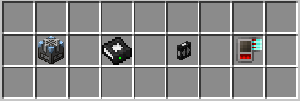

# Bulk Cells

This is a quick overview to the best storage addons you'll ever need :]  

In this section, You'll find **How to Use Bulk Cells**, the **characteristic of the Bulk Cells** itself, and the **general idea of "Bulk Storage"**.  

## Bulk Concepts

!!! danger "You can skip to ``How To Use`` sub-chapter if you dislike reading"  
???+ warning "Familiarize yourself with these required items"
      
    * Cell Workbench  
    * MEGA Bulk Item Storage Cell  
    * MEGA Decompression Module  
    * Compression Card  

Before we went deeper, One might asks what is "bulk" and why we use it in storage? moreover related to AE2.  

Now take a look at this mess:  

  

From the image above, there's **random things** like building blocks, seeds, some saplings, and miscellaneous materials. We also notices that most of these items **does not exceeed 1000**. We'll call this as **Random Mess** for now.  

In contrary, from the image below, we can see that those items is **stored at a very big numbers** compared to the previous ones. Instead, we'll refer this as **Bulk Mess**  

  

### General vs Bulk Storage 

All of those random bits and pieces items typically stored insides what we call **"General Storage"**. In a literal sense, every dumps & junks we insert to the network, will **eventually ends up** in this type of storages. Just like the Random Mess we had before. Any other things then (generally) will be stored insides a **"Bulk Storage"**  
!!! tip "A literal "storing items in bulks" !"

### Partition?

Just in case it's not obvious now, 'partitioning' cells is an important aspect when we talk about bulk storage. Imagine your creeper farm generating thousands gunpowder per minutes, this will clogs up your 'general storage' quickly over time (you don't want your cells is filled up with gunpowder **only** didn't you?).  

In this case, we **partitions** a cell (generally the ones who can stores alot) and assigned it to a specific cell. **Priority System** in AE2 means you can tell items to go into a specific storage (or drives) first, before it goes into another storage.  

???+ note "On the topic of General Storage vs Bulk Storage & Partitions in-between"
      
    The system works like this:   
    1. You insert the items into the network   
    2. The network now tried to "store" said items into the valid 'storage'  
    3. It checks the valid storage with the highest priority (in this case, Bulk storage)  
    4. If it fails to store said items into the Bulk Storage, it checks agains the next valid storage  
    > Thus gunpowder always get stored first inside bulk storage, and anything that isn't gunpowder stored inside general storage. It doesn't clogs the system, and you can always dump more junks into the system 

For a better grasp of the differences between the two, take a look at this table:  

| **General Storage**    | **Bulk Storage**    |
|:---:|:---:|
| Typically stores random things | Typically stores specific items (mainly resources/mob drops/farm drops) |
| Ex. Cobble walls, doors, fence, lantern, furnace | Ex. Iron ingots, spruce logs, diamonds, rotten flesh, wheat |
| Doesn't really wants "partition" | Partition is a must (at the very least, highly suggested) |
| Requires less works | Usually more steps to do |
| Good for dumping unorganized items | Good for optimizing your network contents |
| Tends to be used less per ME Drive | Tends to be used more per ME Drive |
| Identic with lower amount of items (less than 5k, etc.) | Identic with high number of items (thousands/millions/billions even!) |
  

## What Is Bulk Cells?

**MEGA Bulk Item Storage Cell**, further referred as 'Bulk Cells', is a storage cell from an addon mods called MEGA Cells by ninety.  

Bulk Cells is incredibly powerful. A single cell can only holds 1 type of item, **but** it's theoretically able to store ``maxLong`` value. Which is ``9.223.372.036.854.775.807`` (9.2 Quintillions) of items, **practically infinite**.  

!!! abstract "But hey, there's more"
    On top of storing items, Bulk Cells also have the abilities to **compress & decompress** items! 

### Compress & Decompress
Having to make a pattern to craft ``nugget`` from an ``iron ingots``, and another pattern for crafting ``iron block``, AND THEN another pattern to craft those back into iron ingots is surely labour-intensive. Up until now, you might be familiar by using **Storage Drawers** to do this kind of thing. A Compacting Drawers to be exact.  

But this comes with a small problem.  

Luckily the Bulk Cells already takes care of that for us.

### Storage Drawers?

## How does it work?

!!! danger "Disclaimer"
    This sub-chapter may or may not explain it 1:1 to the actual backend code logic. This sub-chapter only gives the rough ideas on why things works

    

 
## How To Use It?

*Here comes the main dish*  
Up to this point, you should already know why bulk matters, how to do partitions, and the items required for it (refer to the notes in Bulk Concepts)

> MEGA Cells | [CurseForge](https://legacy.curseforge.com/minecraft/mc-mods/mega-cells)  
> ExtendedAE | [CurseForge](https://legacy.curseforge.com/minecraft/mc-mods/ex-pattern-provider)