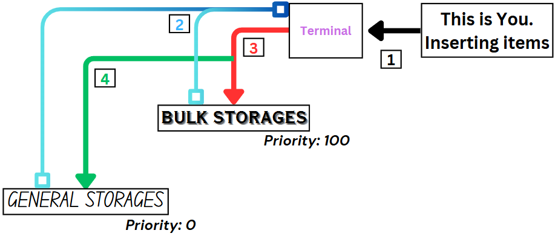

# Bulk Concepts

???+ warning "Familiarize yourself with these required items"
      
    * Cell Workbench  
    * MEGA Bulk Item Storage Cell  
    * MEGA Decompression Module  
    * Compression Card  

### Where bulk terms is used
Before we went deeper, One might asks what is "bulk" and why we use it in storage, or where do we find it? moreover related to AE2.  

Now take a look at this mess:  

  

From the image above, there's **random things** like building blocks, seeds, some saplings, and miscellaneous materials. We also notices that most of these items **does not exceeed 1000**. We'll call this as **Random Mess** for now.  

In contrast, from the image below, we can see that those items is **stored at a very big numbers** compared to the previous ones. Instead, we'll refer this as **Bulk Mess**  

  

### General vs Bulk Storage 

All of those random bits and pieces of items previously typically stored insides what we call a **"General Storage"**. In a literal sense, every dumps & junks we insert to the network, will **eventually ends up** in this type of storages. Just like the Random Mess we had before. Any other things then (generally) will be stored insides a **"Bulk Storage"**  
!!! note "A literal "storing items in bulks" !"

### Partition?

Just in case it's not obvious now, 'partitioning' cells is an important aspect when we talk about bulk storage. Imagine your creeper farm generating thousands of gunpowder per minutes, this will clogs up your 'general storage' quickly over time (you don't want your cells is filled up with gunpowder **only** didn't ya?).  

In this case, we **partitions** a cell (generally the ones who can stores alot) and assigned it to a specific cell. **Priority System** in AE2 means you can tell items to go into a specific storage (or drives) first, before it goes into another storage.  

???+ info "Items route in the network on General Storage vs Bulk Storage & Partitions in-between"
      
    The system works like this:   
    1. You insert the items into the network   
    2. The network now tried to "store" said items into the valid 'storage'  
    3. It checks the valid storage with the highest priority (in this case, Bulk storage, which only accepts gunpowder)  
    4. If it fails to store said items into the Bulk Storage (say, a stick), it checks again the next valid storage  
    > Thus gunpowder always get stored first inside bulk storage, and anything that isn't gunpowder stored inside general storage. It doesn't clogs the system, and you can always dump more junks into the system. **This is why bulk storage is important** 

For a better grasp of the differences between the two, take a look at this table:  

| **General Storage**    | **Bulk Storage**    |
|:---:|:---:|
| Typically stores random things | Typically stores specific items (mainly resources/mob drops/farm drops) |
| Ex. Cobble walls, doors, fence, lantern, furnace | Ex. Iron ingots, spruce logs, diamonds, rotten flesh, wheat |
| Doesn't really wants "partition" | Partition is a must (at the very least, highly suggested) |
| Requires less works | Usually more steps to do |
| Good for dumping unorganized items | Good for optimizing your network contents |
| Tends to be used less per ME Drive | Tends to be used more per ME Drive |
| Identic with lower amount of items (less than 5k, etc.) | Identic with high number of items (thousands/millions/billions even!) |

> Functional Storage | [CurseForge](https://legacy.curseforge.com/minecraft/mc-mods/functional-storage)  
> MEGA Cells | [CurseForge](https://legacy.curseforge.com/minecraft/mc-mods/mega-cells)  
> ExtendedAE | [CurseForge](https://legacy.curseforge.com/minecraft/mc-mods/ex-pattern-provider)