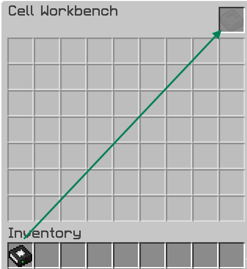
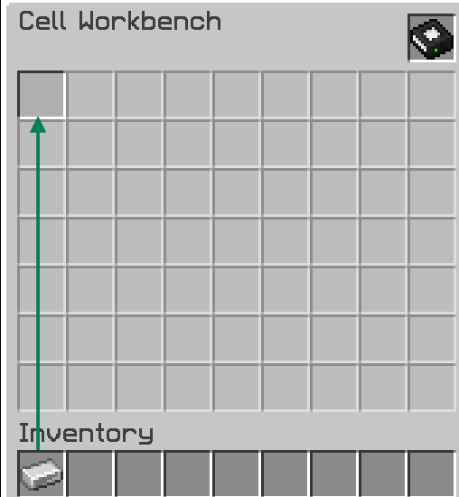
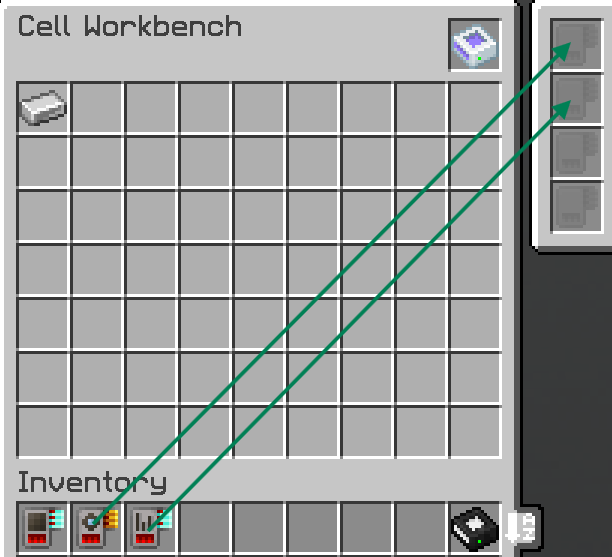
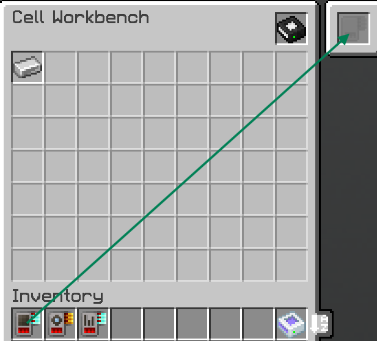
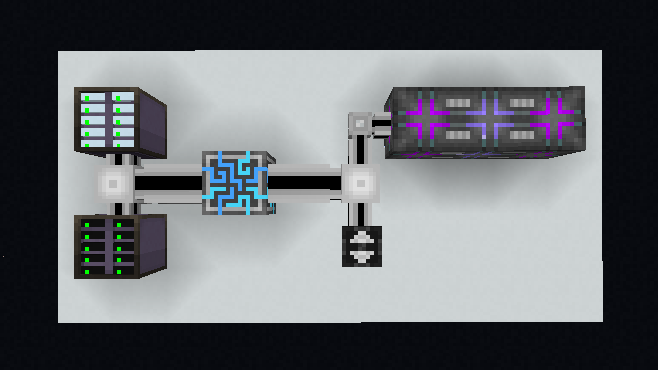

# *How to do X, Y, Z???*

*Here comes the main dish*  

Up to this point, you should already know what is bulk and why it matters. Aswell as the **items required** for it as well (refer to the requirements in the [Concepts](bulkconcept.md) Chapter) 

## Partition
1. You need a cell & Cell Workbench  
    
2. Drag your cell into the slot on top-right corner  
    
3. Drag your desired items to partitions into the 7x9 empty slots (it's only 1 for Bulk Cells). You can drag from **inventory or JEI/EMI**  
     
4. This step will vary, depends on what cell did you use. Generally this is where you install **Card Upgrades** for the partitioned cells. Mainly **Overflow Destruction** &/ **Equal Distribution**  
??? tip "For Bulk Cells, they only accepts **Compression Card**"
    !!! danger "They can't do any compression if there's no compression card installed"
     

## Basic Functional Setup

With the importance of **Decompression Module** & **Priority System**, at the very least your network should look like this.  
  

* Top-left drive bay is for 'General Storage' with lowest priority  
* Bottom-left drive bay is for 'Bulk Storages' with **highest priority**  
* **Decompression Module** is crucial to allow this network to compress/decompress stored items inside a bulk cell  
* Because they make a *ghost-patterns*, a basic **CPU multiblock** is no less important (otherwise you can't decompress things)  

> Applied Energistics 2 | [CurseForge](https://legacy.curseforge.com/minecraft/mc-mods/applied-energistics-2)  
> MEGA Cells | [CurseForge](https://legacy.curseforge.com/minecraft/mc-mods/mega-cells)  
> ExtendedAE | [CurseForge](https://legacy.curseforge.com/minecraft/mc-mods/ex-pattern-provider)