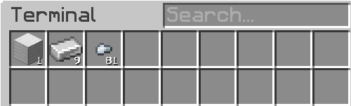

# *Everything About It*

This sub-chapter brings to you the overview of **bulk cells** & it's accompanying trinkets.  

## What is Bulk Cells?
**MEGA Bulk Item Storage Cell**, further referred as 'Bulk Cells', is a storage cell from an addon mods called MEGA Cells by ninety.  

Bulk Cells is incredibly powerful. A single cell can only holds 1 type of item, **but** it stores item in ``BigInt`` value. Which is **frickin' big**, the limitations is your system memory. **practically infinite**.  
> Read more about [BigInt Max Limit](https://stackoverflow.com/questions/12088436/what-does-biginteger-having-no-limit-mean)   

??? tip "Did you know that?"
    Assuming:  
    - You can theoretically produces a resource at a ``maxInt`` value per tick (2.147.483.647 of iron ingots for example)  
    - And do it 24/7  

    It still requires **6 years, 10 months, and 7 days** to only reach max capacity of ``MaxLong``(a 19 digits numbers). And ``BigInt`` can stores **more** than 268.000.000 digits (relative to system memory) ! this also means you do **not** need any kind of Overflow Destruction (or is it?).  

!!! abstract "But hey, there's more"
    On top of storing items, Bulk Cells also have the abilities to **compress & decompress** items automatically! 

### Compression & Decompression
Having to make a pattern to craft ``nuggets`` from an ``iron ingots``, and another pattern for crafting ``iron block``, AND THEN another pattern to craft those back into iron ingots is surely labour-intensive. Up until now, you might be familiar by using **Storage Drawers** to do this kind of thing. A Compacting Drawers to be exact.  

!!! danger "But this comes with a small problem for drawers"  
    Compacting Drawers (and any other variants of physical-storage-compactor from other mods) for the longest time existing never plays nice with AE2. This is because when a storage controller (ones you used to read all the drawers content) reads by a Storage Bus (External Storage application), **it reports the content incorrectly** (it should only report once)
    ??? example "Example of compactors misreports to AE2"
        {.center}  
        {.center height='115px}
        Here we can see that the system reads we have 81 nuggets, 9 iron ingots, and 1 iron block. But clearly **we don't have those**, since that would just means we have 3 iron blocks. When the drawer itself definitely shows **it only has 1**      

!!! note "Luckily the Bulk Cells already takes care of that for us :3"

### Compression Card

### Decompression Module

## Storage Drawers vs Bulk Cells

One might wonder,
!!! quote "Huh. Bulk cells seems just like **Storage Drawers**. Both can **stores alot** & **compresses items**. Why would I use these cells instead of drawers?"  

Then let me present to you the ups & downs.  
WIP

> Functional Storage | [CurseForge](https://legacy.curseforge.com/minecraft/mc-mods/functional-storage)  
> MEGA Cells | [CurseForge](https://legacy.curseforge.com/minecraft/mc-mods/mega-cells)  
> ExtendedAE | [CurseForge](https://legacy.curseforge.com/minecraft/mc-mods/ex-pattern-provider)