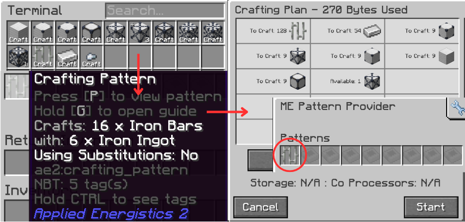
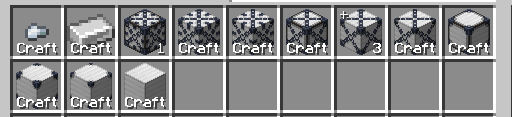

# *Why 1+1 = 2?*

!!! danger "Disclaimer"
    This subchapter may or may not explain it 1:1 to the actual backend code logic. This subchapter only gives you the rough ideas on why things works.

!!! tip "**Compression Card & Decompression Module is crucial** for the network. It enables the network to do any kind of compression/decompression. Otherwise, your Bulk Cells is just a **fancy infinite chest**"

## Compressing/Up Crafting

It has been mentioned before that **Bulk Cells can compress items automatically**.  

With the analogy of having to make patterns to craft ``nuggets`` to ``ingots``, then ``ingots`` to ``blocks``, then ``blocks`` to ``1x blocks`` etc. this can adds up a lot in the **pattern provider**.  

Instead, we can use **Compression Card** inside the bulk cells to enable 'compression'. This will **allow the network** to automatically makes a *ghost-pattern* that handles **all compression**. Yes, ***everything***. From as small as nuggets, up to 9x variants of compressed block (if possible).

## Decompressing/Down Crafting
Borrowing the previous analogy, we also wanted to down craft those ``1x blocks`` back into ``blocks`` and smaller. The bulk cells also **handles down crafting quite similar to compressing**. When a craft request a form of items at a smaller variant 

!!! example "Example, make 9 ``iron blocks`` but we only have ``3x iron blocks``"

Then the system also makes a *ghost-patterns* that handles ``crafting 3x iron into 2x``, ``2x into 1x``, and more until it reaches the desired amount from the system (9 iron blocks).

??? note "This is what I meant"
      
    If we requested **128 Iron Bars** even though the system have enough ingots (in form of a compressed blocks), the system needs to convert it first into ``ingots`` from 3 ``5x iron blocks`` in order to use it. We **do not** have any pattern related to this compression inside the Pattern Provider. Hence, why we refer this to **Ghost Patterns**.

??? question "But WHEN it does the compression/decompression?"
    Generally it happens **when the network interacts with item amounts**.  
    This includes, but not limited to:  
    1. Items **entering** the network  
    2. The Network **exporting out** items  
    3. A **Crafting Requests** from an automation/player-requests for certain compressed items variants  
    4. You, the player, directly taking out/dumping items in the **Terminal**  
    !!! warning "for a regular player usage (it means Me, & **YOU**), all of this doesn't really need to worry about. Don't sweat it out :)"
    !!! tip "If you insert/extract items within the network, if it's possible, it will always get **unified with other compressed variants**. And the system shows the **highest compressed form possible** in the network (here, it's 1 ``9x iron`` & 3 ``5x iron``) "

!!! danger "Regarding Energy Usage"
    It is also worth noting that **every content (items/gas/fluid/etc.) movements inside an AE2 network requires energy** (in the form of AE) and it's relative to the amounts moved per tick. Compressing/Decompressing **is no exception**. On a rare case, One can stumble upon **not enough network buffer** to do any item compression, oftentimes resulting in a **failed Crafting Request**.

> Applied Energistics 2 | [CurseForge](https://legacy.curseforge.com/minecraft/mc-mods/applied-energistics-2)  
> MEGA Cells | [CurseForge](https://legacy.curseforge.com/minecraft/mc-mods/mega-cells)  