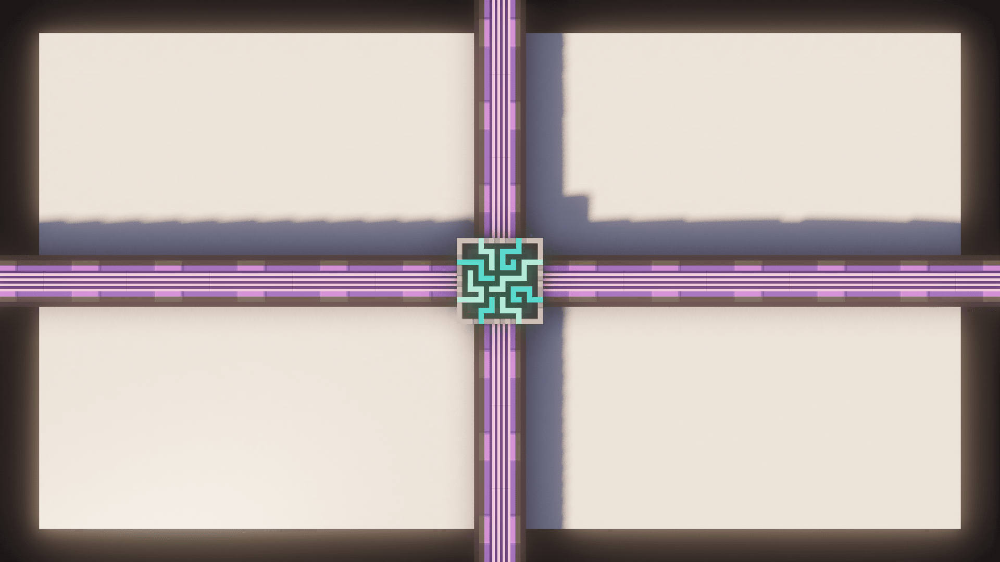
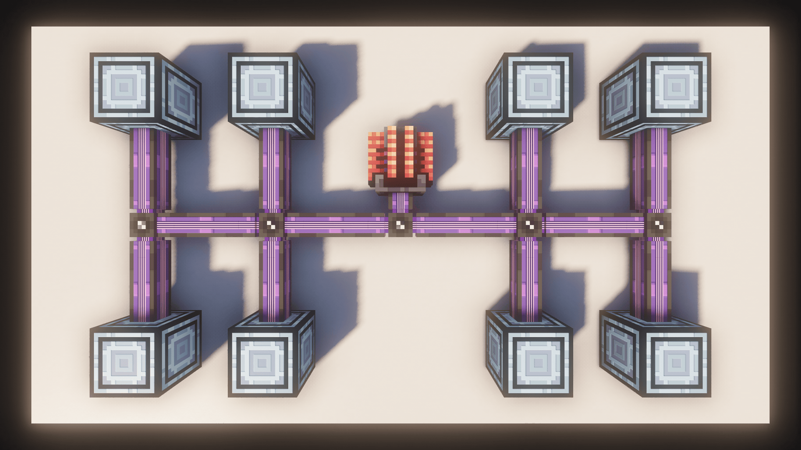
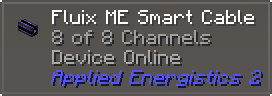
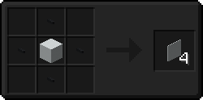
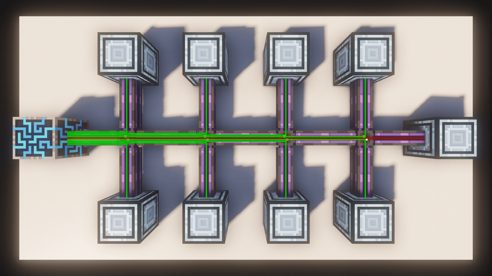
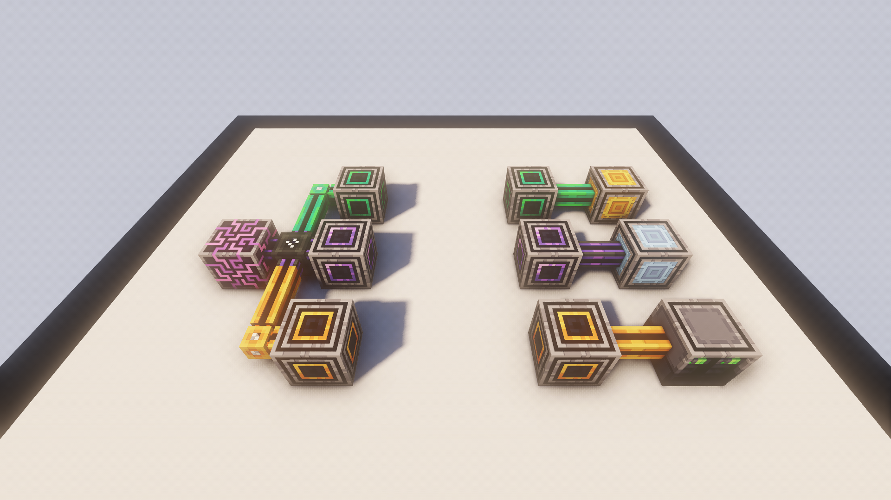

# Channels

---

Here, I'm going to teach you all about Channels and why they're actually not that bad at all.

---

## Obtaining Channels

To even get some Channels, you'll need the **ME Controller** which will provide you with **32 Channels** per face.

### Ad-Hoc Network

You can have a Network **without** a controller, but you can only have a maximum of **8 Devices** in it. Such a network is commonly referred to as an **Ad-Hoc-Network**. You'll need to supply power to it through somthing like the **Energy Acceptor** or the **Crystal Resonance Generator**, a device that can directly connect to AE2 Cables and produces a small amount of free Energy.

---

## Moving Channels

To get your channels to where you want, you'll obviously need some **Cables**. There are **Small Cables** which carry **8 Channels** and **Dense Cables** which carry **32 Channels**

|        Name         | Channels |    Shows Usage    |
|:-------------------:|:--------:|:-----------------:|
|     Glass Cable     |    8     | :material-close:  |
|    Covered Cable    |    8     | :material-close:  |
|     Smart Cable     |    8     | :material-check:  |
| Dense Covered Cable |    32    | :material-close:  |
|  Dense Smart Cable  |    32    | :material-check:  |

### Cable Variants
Additionally, there are also a handful of **subcategories** of cables.

- **Covered Cables** are purely visual and offer no gameplay advantage
- **Smart Cables** will display the **Amount of Channels** currently used at the top of the screen (Required is WAILA / TOP / Jade / etc.)

### Colored Cables
All Cables are available in **17 different Colors**, all vanilla colors and **Fluix**, which is the "default" color.

- **Colored Cables** will **not** connect to each other.
- **Fluix Cables** will connect to **any** cable.
- To completely prevent cables connecting to each other, use **Cable Anchors**

### Hiding Cables
You can hide Cables using **Facades**. Surround any block with **Cable Anchors**.

---

## Channel Usage

Every device connected to your **ME Network** will need a **Channel** to function. If you don't have enough Channels on a Cable, the device will no work.

???+ example "Imagine **Channels** as **USB-Cables**"
    - You have a bundle of **USB-Cables** (ME Cable)
    - You get those Cables from your **PC** (ME Controller)
    - Each Device you plug in, needs one **USB-Connection** (one Channel)
    - If you run out of **USB-Connections** you still have your Bundle, but no more connections (No more channels on the cable)

---

## Wirelessly moving Channels

When it comes to moving Channels **without** Cables, you have two options.

### Wireless Connector
The **Me Wireless Connector** can move up to **32 Channels** over a short distance and can also be **colored**. They use an **exponential amount** of **Energy** for every block and they do **not** work **cross-dimensionally**. They need to be connected via the **ME Wireless Setups Kit**.

### Quantum Ring
The **Quantum Ring** is a **3x3x1 Multiblock** that can transfer up to **32 Channels** over an **infinite distance** and also functions **cross-dimensionally**. To link two **Quantum Rings** you will need **Quantum Entangled Singularities**, of which you get two by **blowing up** an **Enderpearl** and a **Singularity**.

---

## P2P

The big one. If you want to move a lot of Channels in a single cable, you'll need to use **P2P** or **Point to Point**.

### Portals
You can essentially imagine two **P2P Tunnels** as **Portals** that connect to each other. 

As you can see, the Cable coming from the Controller retains **all Channels** used on it when traveling through the P2P, but the cable actually holding the P2P Tunnels only uses **two Channels**.

### P2P Subnets
Without a Controller, you'll only have **8 Channels** available on the cable connected to the P2P Tunnels. For you to be able to have **32 P2P Input Tunnels** and **32 P2P Output Tunnels**, you'll need a Controller.

Now while this looks almost identical, the difference is pretty significant. You now have **32 Channels** per Controller face, each of which being able to hold **1 P2P Tunnel** for a total of **32 P2P Tunnels** per **Dense Cable**.

### 32 x 32 Channels
In this example, we have **32 P2P Tunnels** connected to the controller on the left and then another **32 P2P Tunnels** connected on the right. Each Colored Cable on the right gets their Channels from the Controller, so we've essentially just moved **1024 (32 x 32) Channels** in a single **Dense Cable** (Technically two Cable cause of the Controller in the middle).

### Linking up P2P
To connect two **P2P Tunnels**, you have to use the **Memory Card**. P2P Tunnels have specified Inputs and Outputs, they are **not** bidirectional. The Input is generally on the Controller.

### Other P2P's
P2P doesn't just exist for channels they also exist for **a lot** more things, with addons adding their own types.

You can transform normal P2P Tunnels into different versions, by using a specific item. You can check what Item by pressing `U` or `Right-Click` on the item in EMI.

