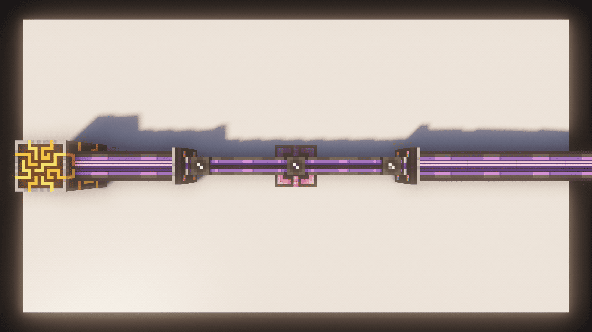
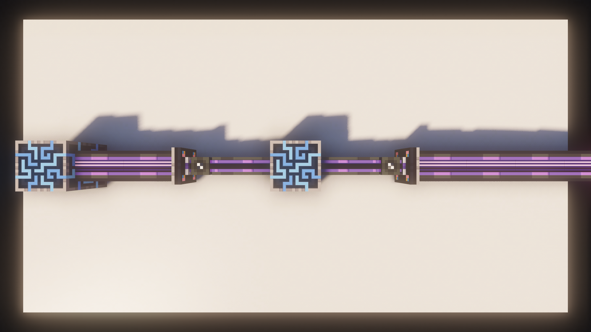
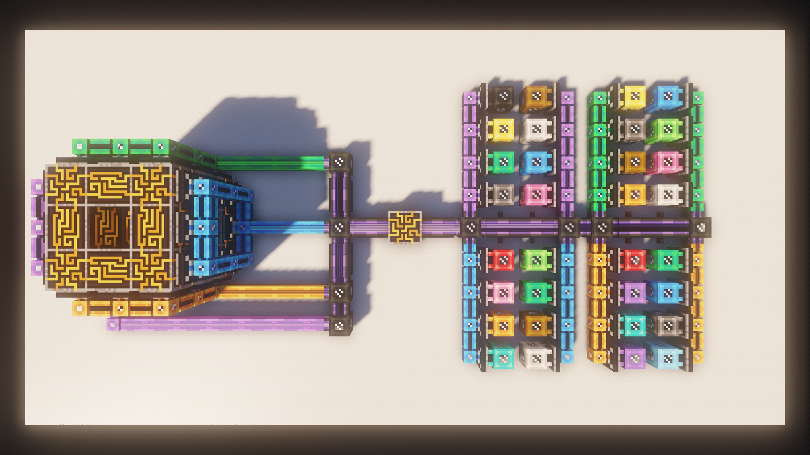
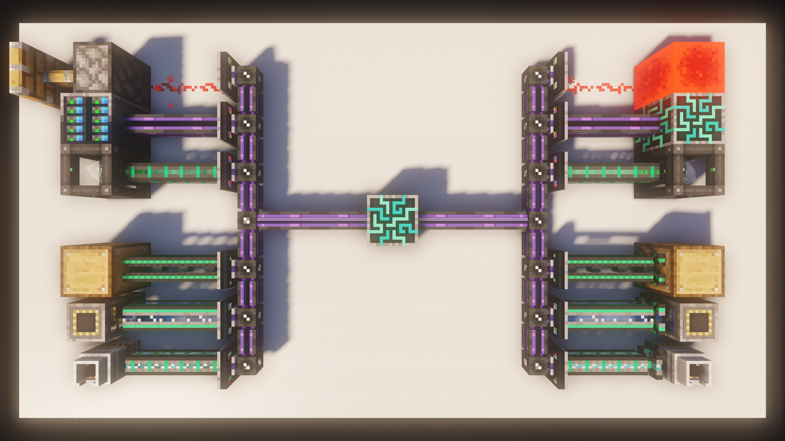

# P2P

The big one, if you want to move a lot of Channels in a single cable.

## Portals
You can essentially imagine two **P2P Tunnels** as **Portals** that connect to each other.

As you can see, the Cable coming from the Controller retains **all Channels** used on it when traveling through the P2P, but the cable actually holding the P2P Tunnels only uses **two Channels**.

## P2P Subnets
Without a Controller, you'll only have **8 Channels** available on the cable connected to the P2P Tunnels. For you to be able to have **32 P2P Input Tunnels** and **32 P2P Output Tunnels**, you'll need a Controller.

Now while this looks almost identical, the difference is pretty significant. You now have **32 Channels** per Controller face, each of which being able to hold **1 P2P Tunnel** for a total of **32 P2P Tunnels** per **Dense Cable**.

## 32 x 32 Channels
In this example, we have **32 P2P Tunnels** connected to the controller on the left and then another **32 P2P Tunnels** connected on the right. Each Colored Cable on the right gets their Channels from the Controller, so we've essentially just moved **1024 (32 x 32) Channels** in a single **Dense Cable** (Technically two Cable cause of the Controller in the middle).

## Linking up P2P
To connect two **P2P Tunnels**, you have to use the **Memory Card**. P2P Tunnels have specified Inputs and Outputs, they are **not** bidirectional. The Input is generally on the Controller.

## Other P2P's
P2P doesn't just exist for channels they also exist for **a lot** more things, with addons adding their own types.

You can transform normal P2P Tunnels into different versions, by using a specific item. You can check what Item by pressing `U` or `Right-Click` on the item in EMI.

---

> Applied Energistics 2 | [Curseforge](https://www.curseforge.com/minecraft/mc-mods/applied-energistics-2)