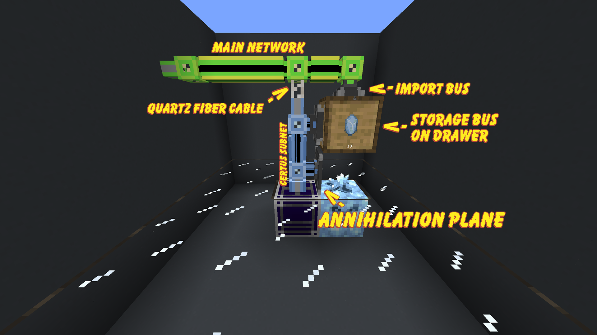
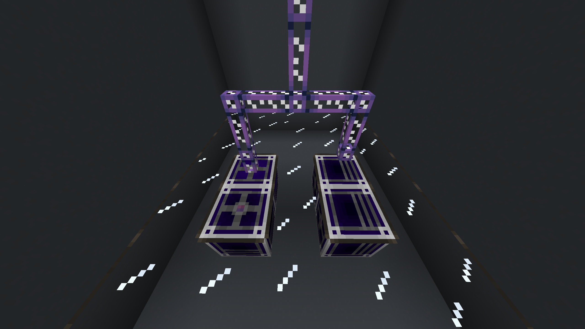
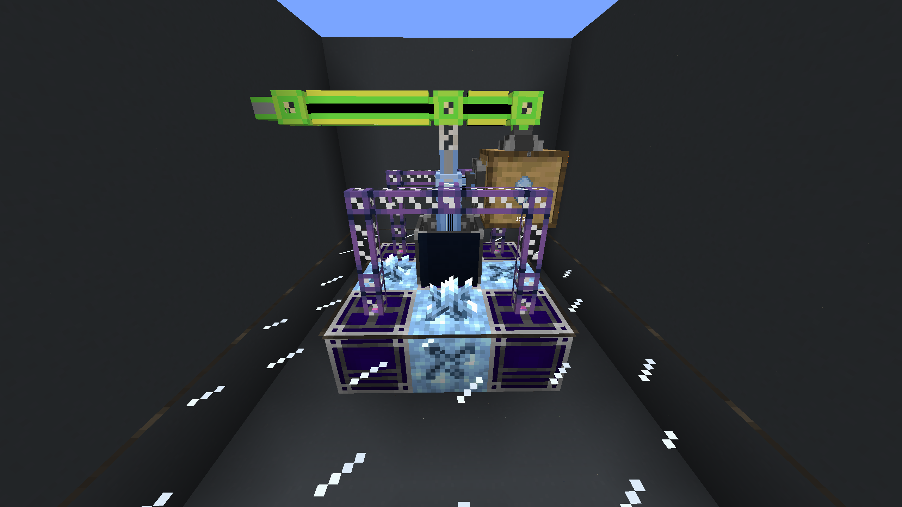

# Certus Crystal Automation

This setup is not the only setup there is, there are different setups you can do to farm certus quartz. This is just the one that most people probably use.

---

## Items Required

???+ information "Items Required"
	- [ ] 1-5x Growth Accelerators
	- [ ] 1-4x Flawless Budding Certus Blocks
	- [ ] 1-4x Annihilation Planes (with optional efficiency and fortune enchants)
	- [ ] 1x Import Bus
	- [ ] 1x Storage Bus
	- [ ] 1x Storage Drawer
	- [ ] 1x Quartz Fiber Cable
	- [ ] Several AE2 cables

??? tip "How to get Flawless Budding Certus"
	Use a **Cardboard box** from **Mekanism** and place it on any flawless certus block to pick it up.

---

## Setting it up

!!! info "Click on the image to make it bigger!"

{.center}

1. Place a **Growth Accelerator** and your **Flawless Certus Block** next to each other.
2. Put **2x AE2 cables** on top of the growth accelerator then a **Quartz Fiber**, then place your **Annihilation Plane** facing towards the budding certus.
3. Place a **Storage Bus** and a **Drawer** above the annihilation plane.
4. Place **1x Certus Quartz** into your drawer and *lock it* with a **Configuration Card**.
5. Place an **Import Bus** on top of your drawer and connect it and the quartz fiber to your main network.

??? question "My cables aren't connecting to my Growth Accelerator!"
	You need to make sure it's pointed up so the grid is facing the sky. The left ones are in the correct orientation while the ones on the right are not.
	
	{.center}

---

Below is an example of a full farm, Fluix Cables are used for demonstration purposes only, you are free to use whatever cable you want.

{.center}

## How it works

This entire setup will only take **1 channel** of your main network which is from the **ME Import Bus**. The **Quartz Fiber** provides power to the **Certus Subnet** and keeps it isolated from the rest of your network.

We use a storage drawer with certus locked because it forces your annihilation planes to break only mature crystals. All other growth stages will only drop certus quartz dust.

In the ATM modpacks most players will likely use **Mystical Agriculture** or **Productive Bees** to produce certus quartz as both those methods are much faster and very simple.

> Applied Energistics 2 | [CurseForge](https://legacy.curseforge.com/minecraft/mc-mods/applied-energistics-2)
