# Sath's ME Core

This will be a Step-by-Step of the Controller I use in my builds, giving you a grand total of **16,384 Channels** over **16 Dense Cables** with **32 P2P Tunnels each**

---

## Requirements

???+ list "Items required"
    - [ ] 208x ME Controller
    - [ ] 512x P2P Tunnel
    - [ ] 32x Wireless Connectors
    - [ ] a lot of ME Cables
    - [ ] Color Applicator (recommended)
    - [ ] Personal Shrinking Device (recommended)

## Base

For the Base, you'll need approximately **13x13x13** Blocks of Space.

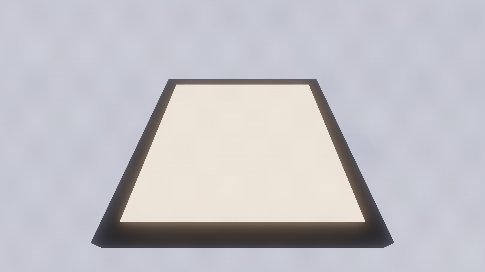

Go up **3 Blocks** and build the following structure

Then extended it upwards, connecting the smaller cubes like this

Build it up all the way

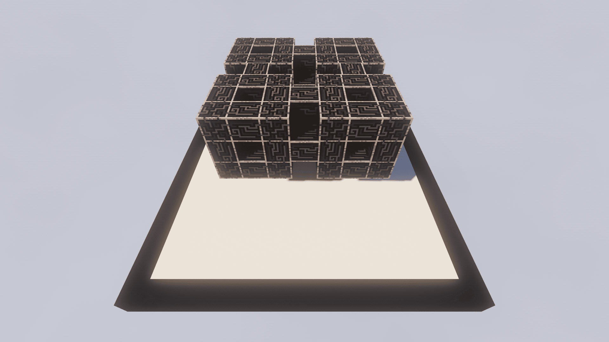

Then add the same connections on top

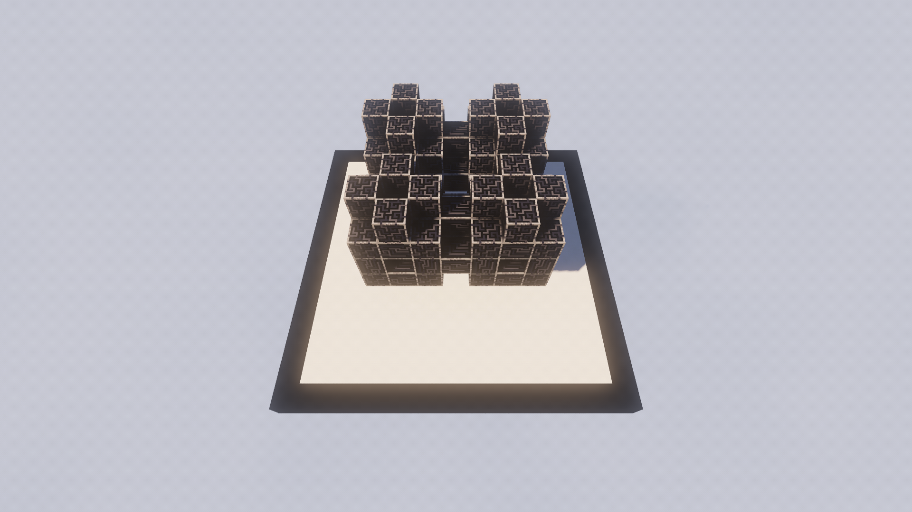

And now mirror the entire thing

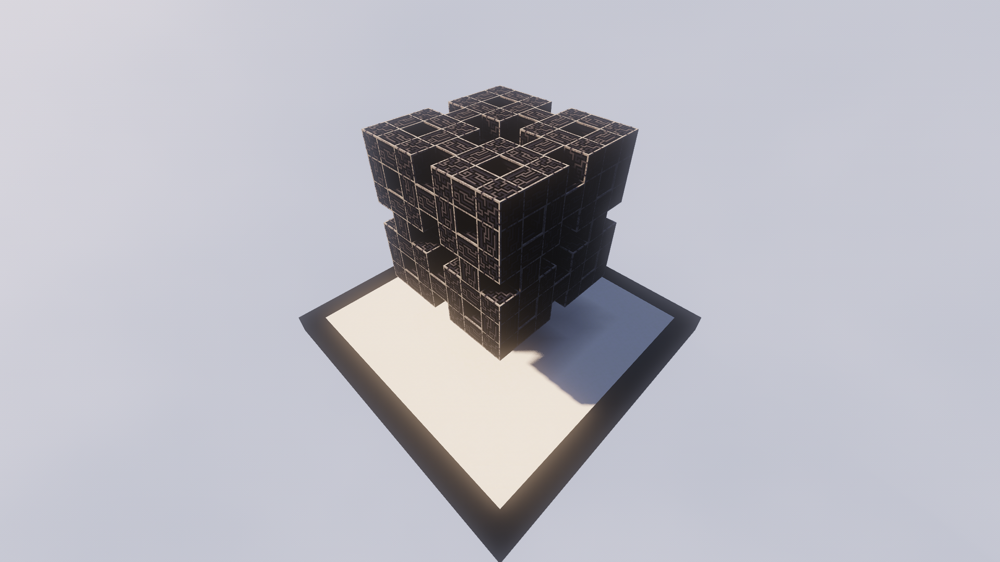

## P2P Tunnels

For starting the P2P Tunnel placement, pick a side and copy this

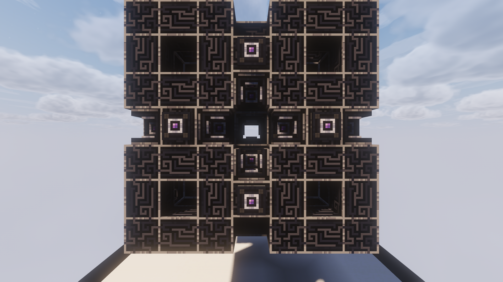

Then add cables in any color

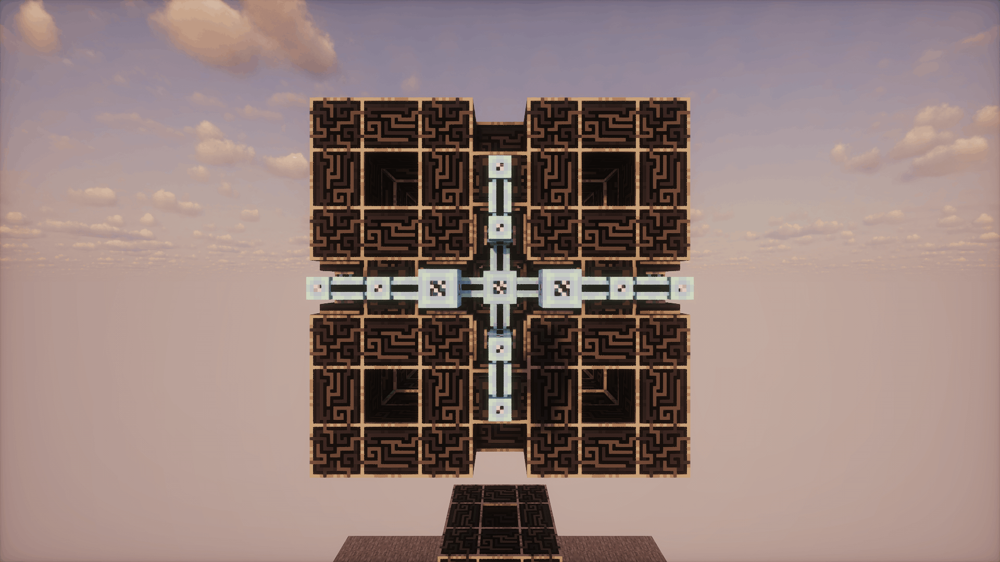

Then add Dense Cables and a **Wireless Connector**

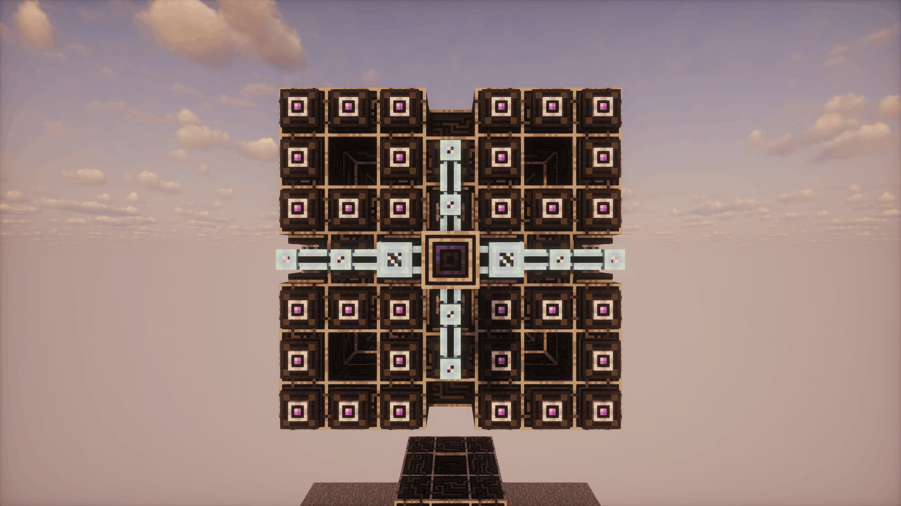

!!! warning "Make sure to **color** the **Wireless Connector** in the same color as the cables using the **Color Applicator** (it won't update if it's unpowered, but you can see the color with Jade)"

Then build this around

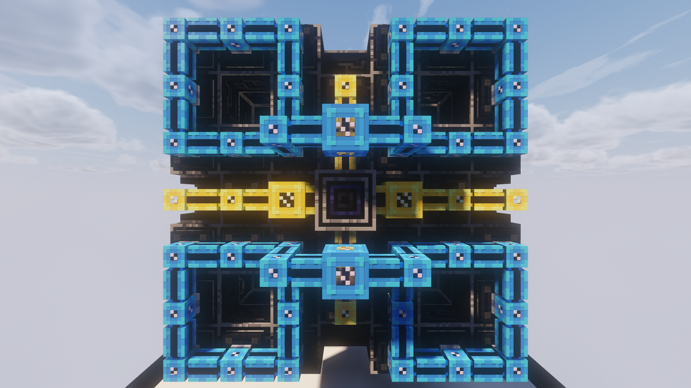

For the next side, you need to rotate the middle contracture by 90 degrees

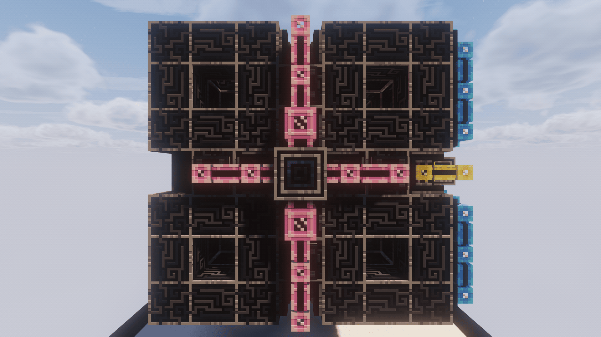

And now just add the same thing on top as before

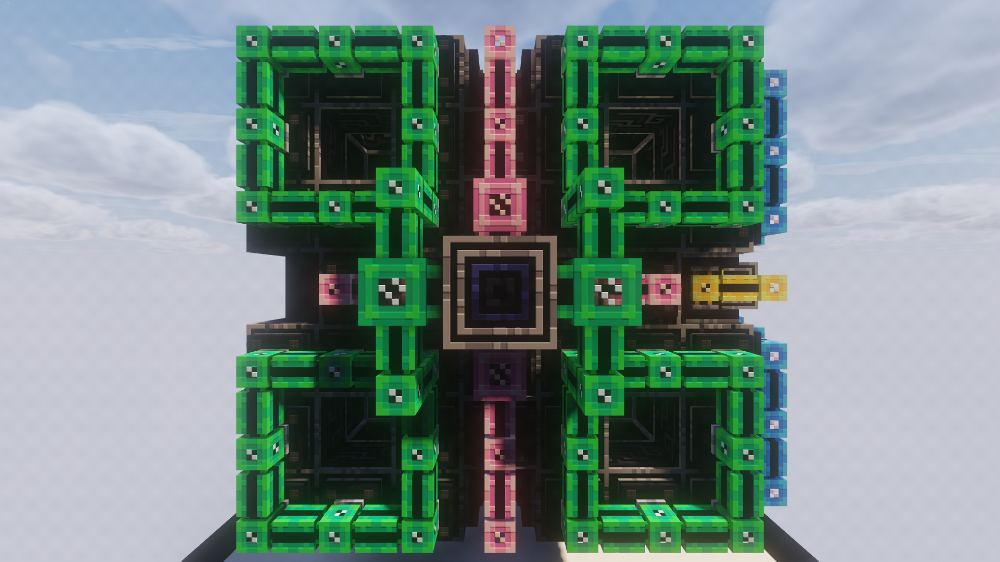

Repeat this for all 6 sides

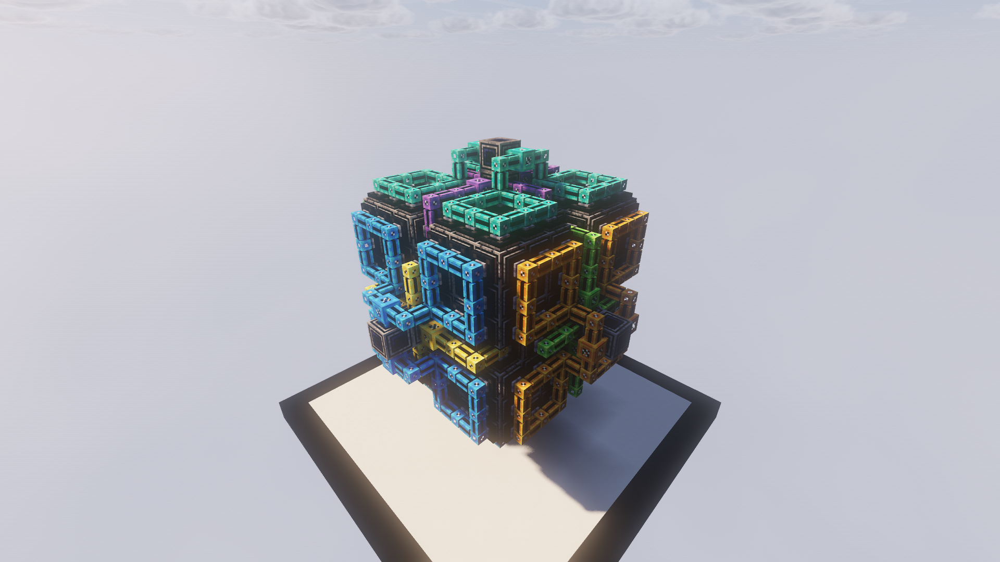

## Inner P2P

For the four Connectors on the **inside** of the controller, it's easiest if you're **tiny**. Use the **Personal Shrinking Device** for that and then build the following inside **1 Corner**

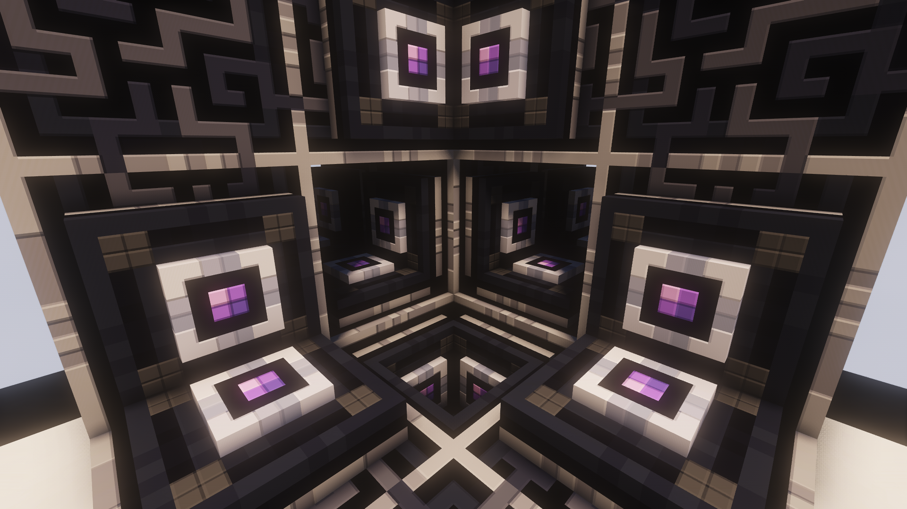

!!! info "The structure is cut open here to make it easier to view."

Add cables like this

And finally the **Wireless Connector**

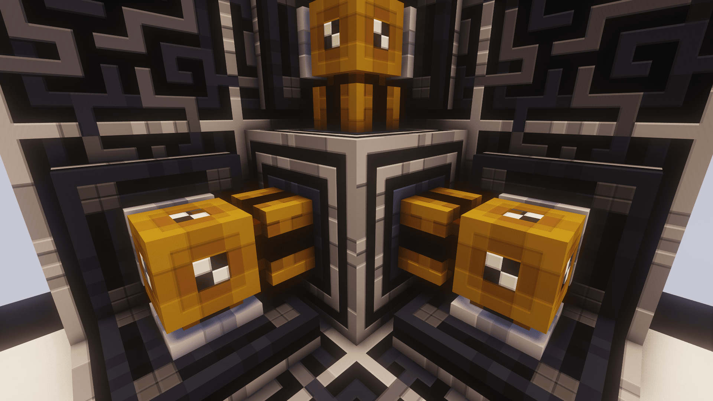

Repeat this in the **diagonally opposite corners**. In the end, it should look like this

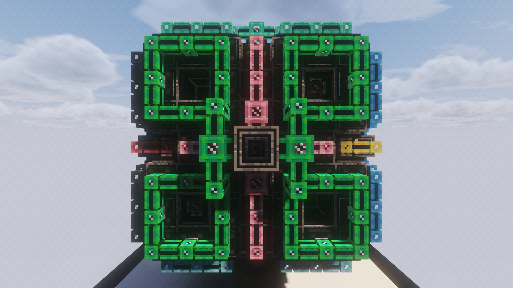

## Wireless Connectors

Once you're done with all that, you can build the following structure and mirror it in each corner. I'm using **Creative Energy Cells** here, but you can use anything to power the **Wireless Connectors**

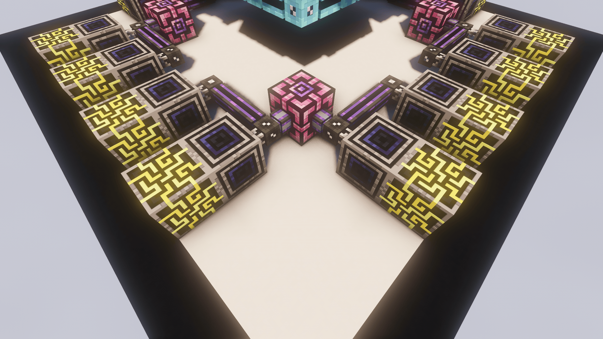

Finally, link the **Wireless Connectors** and add a **Subnet Controllers**

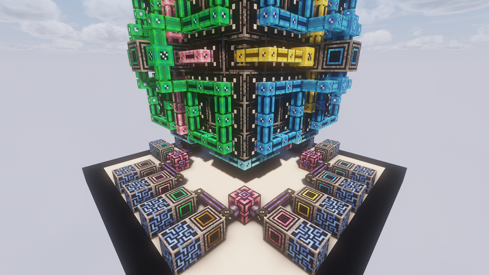

## Using the Controller

To actually get **Channels** from the controller, you can pull a **Dense Cable** from the small controllers at the bottom.
Then pull of a **small Cable** from that and add a **P2P Tunnel**. 
Connect it to one from that line as the dense Cable originates and you're done

> Applied Energistics 2 | [CurseForge](https://legacy.curseforge.com/minecraft/mc-mods/applied-energistics-2)
