# Sath's ME Core

This will be a Step-by-Step of the Controller I use in my builds, giving you a grand total of **21,504 Channels** over **21 Dense Cables** with **32 P2P Tunnels each**

---

## Requirements

???+ list "Items required"
    - [ ] 228x ME Controller
    - [ ] 672x P2P Tunnel
    - [ ] 46x Wireless Connectors
    - [ ] 380x ME Smart Cable
    - [ ] 30x ME Dense Smart Cable
    - [ ] Color Applicator (recommended)
    - [ ] Personal Shrinking Device (recommended)

I highly recommend viewing the images in **Gallery Mode** to better see what changed between each step. Click on the first image and use the **Arrows** at the **Edge** of the screen

## Base

You need around at least a **13x13** area to build this controller

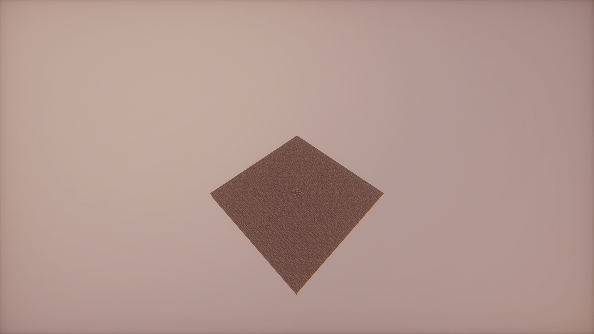

Start with a smaller subnet controller

!!! info "This can theoretically be placed anywhere, you don't have to build it underneath the main core"

Make it **3x3x3**

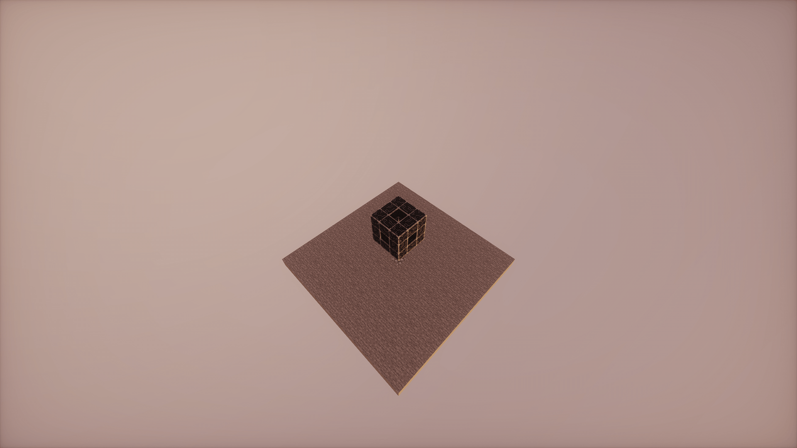

Go up at least **3 Block** and build this structure

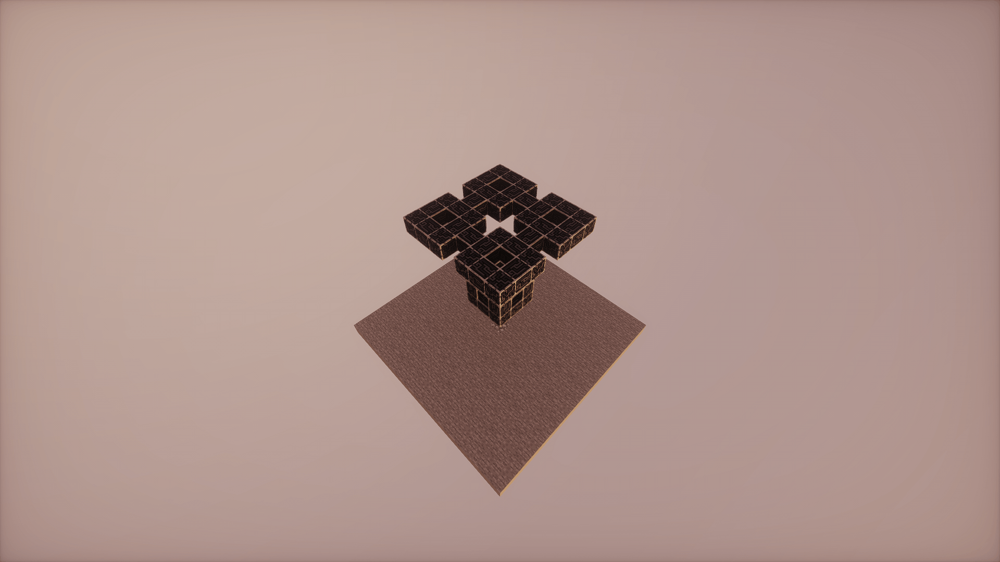

Then build each of the corners as another, smaller **3x3x3** controller

In a **+** Shape build out a Controllers to connect the neighbouring corners

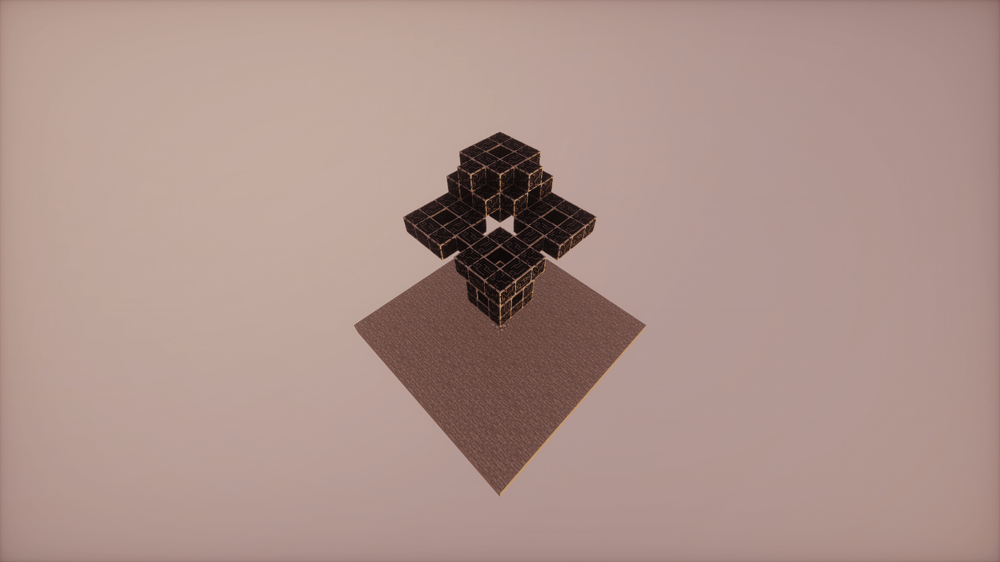

Repeat this for all 4 corners

Then on top of each of the corners go up in a **+** again

And now mirror the entire structure on top

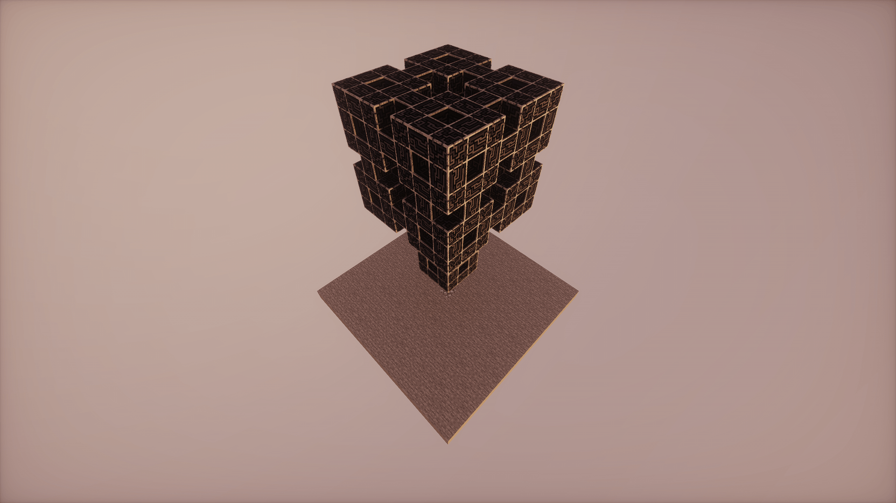

## P2P

!!! warning "Always make sure to color all cables and especially the wireless connectors to prevent anything from connecting"
    

!!! danger "Are your cables/P2P Tunnels complaining about missing channels? This happens while they are unpowered, you can ignore this until the last step"
    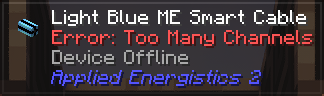

Choose a side of the controller and build the following pattern with **P2P Tunnels**

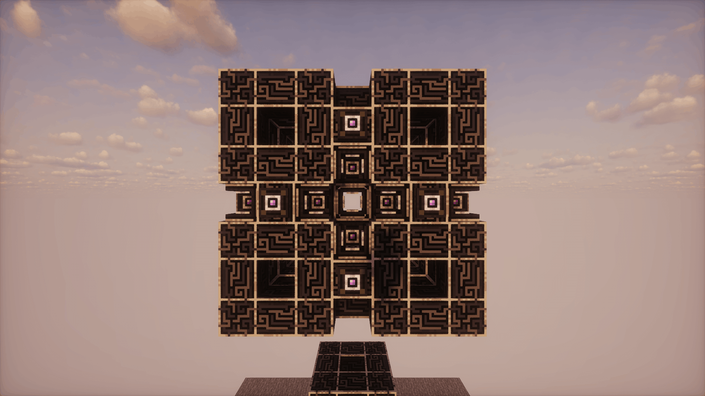

Then add **Smart Cables** in these places

And **Dense Cables** here

Add a **Wireless Connector** here and then build this pattern of **P2P Tunnels**

**Smart Cables** again

And **Dense Cables** and the **Wireless Connector**

For the next side, you have to rotate the initial pattern 90 degrees

Then the same cables as before

Then the wireless connector

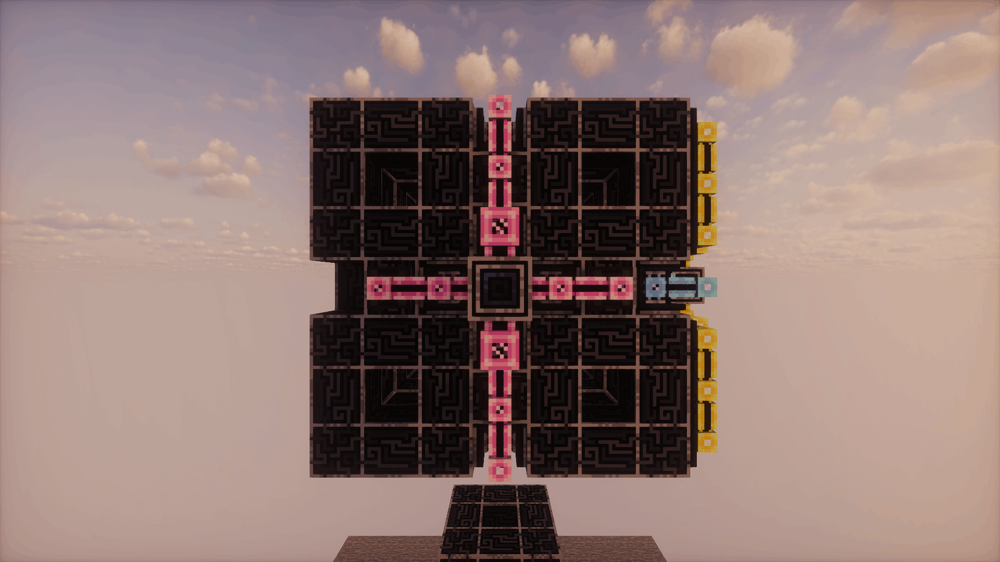

And now just the outer pattern again

Repeat this for every side of the controller

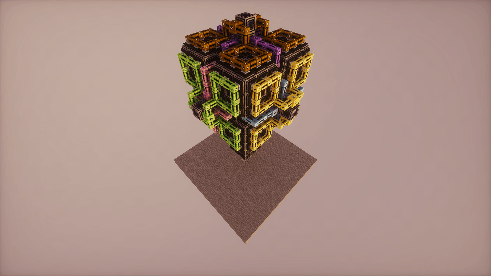

## Edges

The edges are a tiny bit more complicated, so I've cut out one to better show you what you have to do

Add **4 P2P Tunnels** on every side

Put a **Wireless Connector** in the middle

And fully surround it with P2P Tunnels

This is what it now looks like. We're looking at this from the middle of the controller

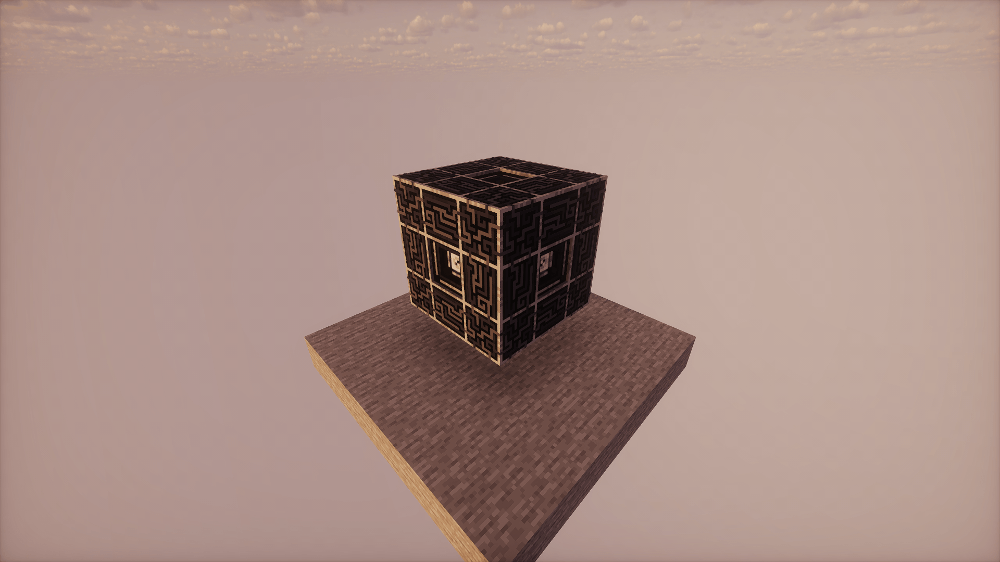

This is the pattern you should build in the top corners

And this in the lower corners

## Inside

The inside is fairly straight forward

Build a **+** Pattern again

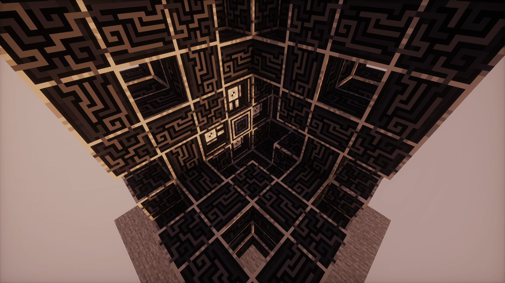

An **H** Pattern in the middle

And another **+** Pattern

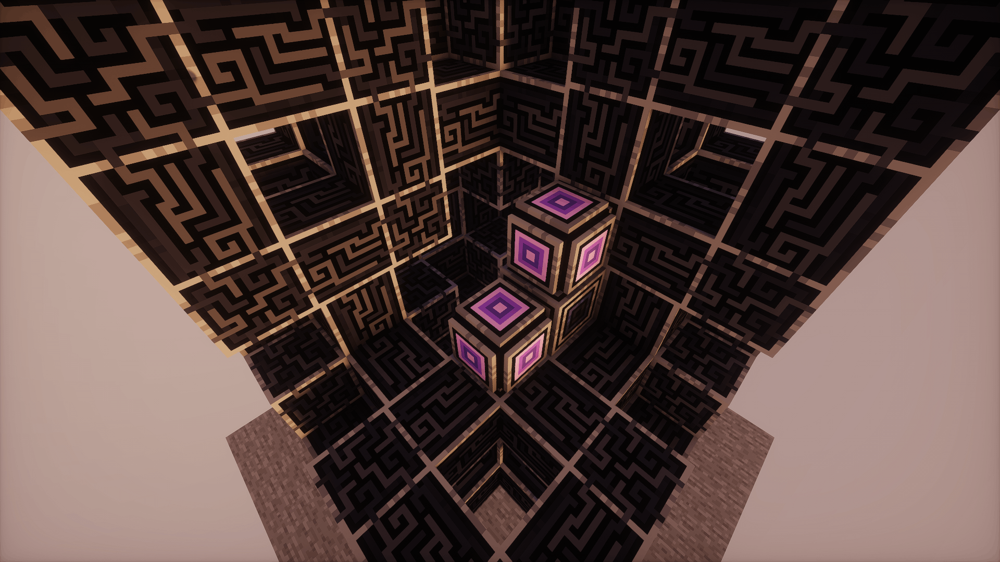

## Subnet Controller

To now make use of all those channels you use the subnet controller underneath

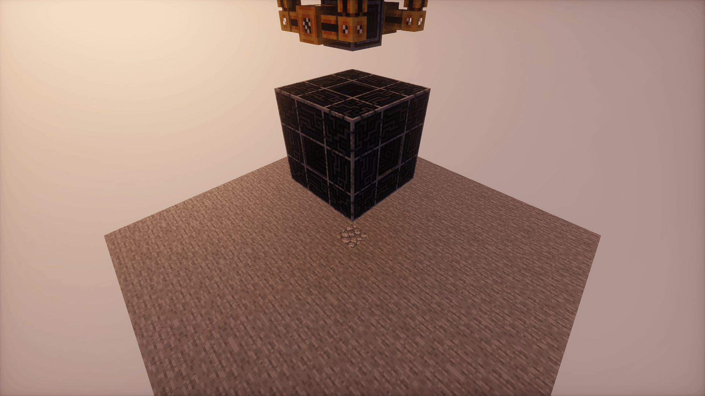

Slap all those wireless connector on there and connect them to all the ones from the main controller.
It doesn't matter how you place them, as long as none of the ones next to each other have the same color

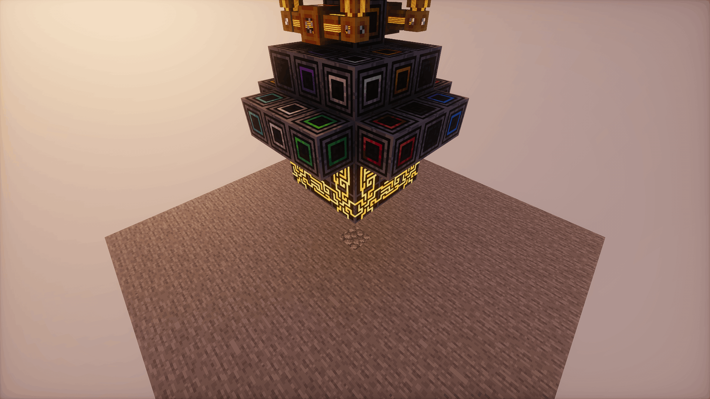

## Power

To power everything, you have to supply power to the **Subnet Controller**.
Afterwards just remove a **1** of the **P2P Tunnels** and replace it with a **Quartz Fiber** to power the main core

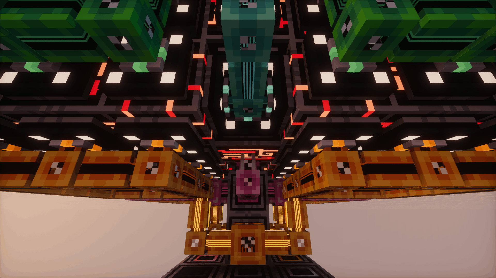

In the end it looks something like this. You can pull up to **21 Dense Cables** from the Subnet Controller now

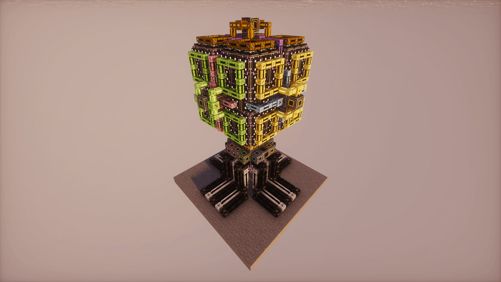

> Applied Energistics 2 | [CurseForge](https://legacy.curseforge.com/minecraft/mc-mods/applied-energistics-2)
