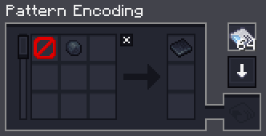
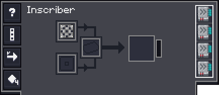
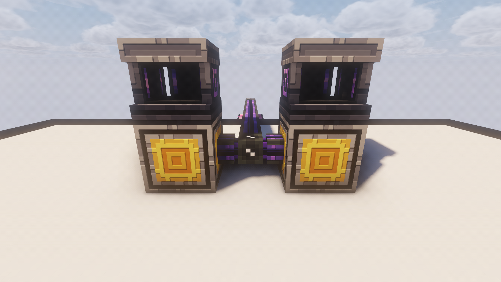
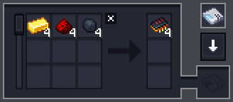

# Inscribers

Here you'll find some example setups for automating Inscribers.

---

## Easy Setup using AE2

This setup is incredibly easy, because it takes almost **no effort** to set up and is technically **infinitely expandable**.
A drawback is that it takes quite **a lot** of Channels if you want to scale it up.

### Items required

??? list "Items required"
    - [ ] 2x Inscribers
    - [ ] 2x Pattern Providers
    - [ ] 1x Universal Press
    - [ ] Patterns
    - [ ] AE2 Cables 

### Patterns
For the **Circuit Patterns**



!!! warning "Remove the **Inscriber Press** if you copy the recipe from EMI!"

For the **Processor Patterns** copy straight from EMI. You don't have to edit anything


### Inscribers
For the Inscriber making the **Circuits** add a **Universal Press**.



For the Inscriber making the **Processors**.


??? info "Using Extended Inscribers"
    - If you'd rather use **Extended Inscribers**, make sure they are locked to "Stack to 1"
    - Make the Pattern so that **Batches of 4** get made each time. `Middle-Click` to change the amount


Place two inscribers, one with **Universal Press** and one **without**



!!! warning "Always make **sure** that you have auto-export through any extraction side enabled"

### Pattern Provider
For the Pattern Provider **with** the Press


For the Pattern Provider **without**


### Expansion
You want to expand the setup? 

- You can add up to **4 Inscribers** around a **single** Pattern Provider
- **Repeat** all the steps above and make a **second** setup. AE2 will use **both** for autocrafting

---

## Snow's SFM Setup

!!! info "This Setup was made by **𝓢𝓷𝓸𝔀** on the ATM Discord."

### Items required

This list assumes you're going for the scale shown here.

??? list "Items required"
    - [ ] 200x Universal Press
    - [ ] 75x Extended Inscribers
    - [ ] 1x Pattern Providers
    - [ ] 75x Inventory Cable
    - [ ] 1x Factory Manager
    - [ ] 1x Mekanism Energy Cube
    - [ ] 1x Barrel

### SFM Code

??? list "Super Inscriber Factory"
    ```
    name "Super Inscriber Factory"

    every 2 ticks do
        input fe:: from cube top side
        output fe:: to power top side
    end

    -- setup, can be disabled after presses are loaded
    every 200 ticks do
        input from buffer
        output 4 item::*_press to each insc1 top side slots 0, 4, 8, 12
    end

    -- reset - fixes when inscribers only get 1 - 2 ingredients
    every 200 ticks do
        input from insc2 slots 0, 1, 2, 4, 5, 6, 8, 9, 10, 12, 13, 14
        output to buffer
    end

    -- each
    every 20 ticks do
        input from buffer
        input
            printed_silicon,
            printed*processor
            from insc1
            slots 3, 7, 11, 15
        output
            diamond,
            gold_ingot,
            certus_quartz_crystal to each insc1
            slots 2, 6
        output silicon to each insc1
            slots 10, 14
        output to buffer
        forget


        if buffer has >= 4 "redstone"
            and buffer has >= 4 printed_silicon
            and buffer has >= 4 printed*processor then
        
            input from buffer
            output 4 printed_silicon to each insc2
                slots 1, 5, 9, 13
            output 4 printed*processor to each insc2
                slots 0, 4, 8, 12
            output 4 redstone to each insc2
                slots 2, 6, 10, 14
            forget
        end

        input from insc2 slots 3, 7, 11, 15
        output to pp
    end
    ```

### Setup
Make sure the **Processor Patterns** follow this template.



<video width="640" height="360" controls>
  <source src="../img/super_inscriber_factory.mp4" type="video/mp4">
Your browser does not support the video tag.
</video>

!!! warning "Important info"
    - Make sure the **Mekanism Energy Cube** allows output to the **Top**.
    - **insc1** should be **2/3** of your Inscribers, while **insc2** should be the other **1/3**. 

!!! bug "Bugged Interface"
    As of the **26th August** the GUI for the **Label Gun** is bugged, use `Shift + Scroll` instead

!!! tip "Workaround"
    A workaround for if you have GUI's that are invisible or not showing properly, go to your accessibility settings and change this setting to off

    


> Applied Energistics 2 | [CurseForge](https://legacy.curseforge.com/minecraft/mc-mods/applied-energistics-2)
