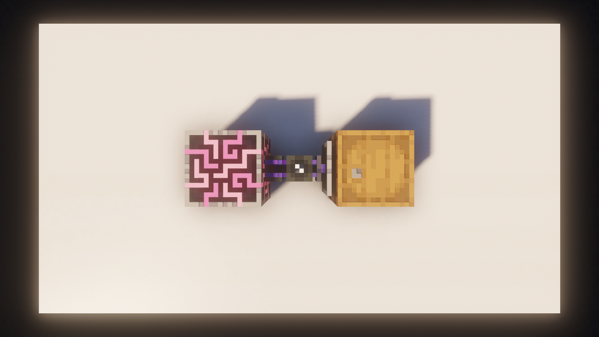

# Storage

This Chapter will explain **Storage Cells**, **Types**, **Bytes** and how and where you can store your Stuff.

---

## Types

For many People, **Types** seem to be quite the limitation, however, if you have **1 ME Drive** filled with **10 Storage Cells** that's already **630 Types**. 630 different Items is quite a lot, where this becomes problematic is when using **NBT Items**.

!!! danger "NBT Items"
    - Storing **NBT Items** in your **ME System** is probably among the worst things you can do
    - **NBT Items** hold large amounts of data (compared to normal items) and therefore take up more memory inside a chunk.
    - If you're using too much memory inside a single chunk, you're game can no longer calculate it all and will kick you out of the world.
    - At this point you're essentially locked out of your world, because reloading the world also reloads the **NBT Items**, kicking you again immediately.
    - For this reason the **Type Limit** exists, to ***firmly*** discourage you from storing **NBT Items** on your Drives.

---

## Bytes

**Bytes** on **Storage Cells**, function like Bytes in a Computer **1 Byte = 8 Items**. Each new **Type** added, takes up **1/128th** of the cells total space.

!!! example "1k Storage Cell"
    - A **1k Storage Cell** has **1024 Bytes** and **63 Types**.
    - **1 Byte = 8 Items** and **1 Type = 8 Bytes**. (1/128th of 1024 Bytes)
    - With **1 Type** used, you get a capacity of (**1024 Bytes** - (**1** x **8 Bytes** for the Type)) x **8** = **8,128 Items**.
    - With **63 Types** used, you get a capacity of (**1024 Bytes** - (**63** x **8 Bytes** for the Types)) x **8** = **4,160 Items**.

!!! info "Formula"
    (**Total Bytes** - (**Types used** x (**Total Bytes** / 128))) x **8 Bytes** = **Total Items**

---

## Storage Cells

There's a bunch of different Cells, these are probably the most important ones.

|              Cell               |             Name             |    Type     | Type Limit |  Amount  |
|:-------------------------------:|:----------------------------:|:-----------:|:----------:|:--------:|
|            |     ME Item Storage Cell     |    Items    |     63     | 1K-256K  |
|        |    MEGA Item Storage Cell    |    Items    |     63     | 1M-256M  |
|            |        MEGA Bulk Cell        |    Items    |     1      | infinite |
|           |    ME Fluid Storage Cell     |    Fluid    |     18     | 1K-256K  |
|       |   MEGA Fluid Storage Cell    |    Fluid    |     18     | 1M-256M  |
|        |   ME Chemical Storage Cell   |  Chemical   |     15     | 1K-256K  |
|    |  MEGA Chemical Storage Cell  |  Chemical   |     15     | 1M-256M  |
|            |     ME Mana Storage Cell     |    Mana     |     1      | 1K-256K  |
|        |    MEGA Mana Storage Cell    |    Mana     |     1      | 1M-256M  |
|          |    ME Source Storage Cell    |   Source    |     1      | 1K-256K  |
|      |   MEGA Source Storage Cell   |   Source    |     1      | 1M-256M  |
|            |      ME FE Storage Cell      |   Energy    |     1      | 1K-256M  |
|   |    ME Infinite Water Cell    |    Water    |     1      | infinite |
|  | ME Infinite Cobblestone Cell | Cobblestone |     1      | infinite |

---

## External Storage

To use other blocks as storage, attach a **Storage Bus** to it and increase the priority. (click the little cog in the top right)

This way, AE2 will treat this Storage as if it was a **Storage Cell**, reading the contents, showing them in your Terminal and prefer that as an input. (useful if you don't want to have an item on your drive AND an external Storage) 

The Controller represents the **ME System** in this case, and the **Barrel** with the **Storage Bus** attached to it is the external inventory.

> Applied Energistics 2 | [CurseForge](https://legacy.curseforge.com/minecraft/mc-mods/applied-energistics-2)
