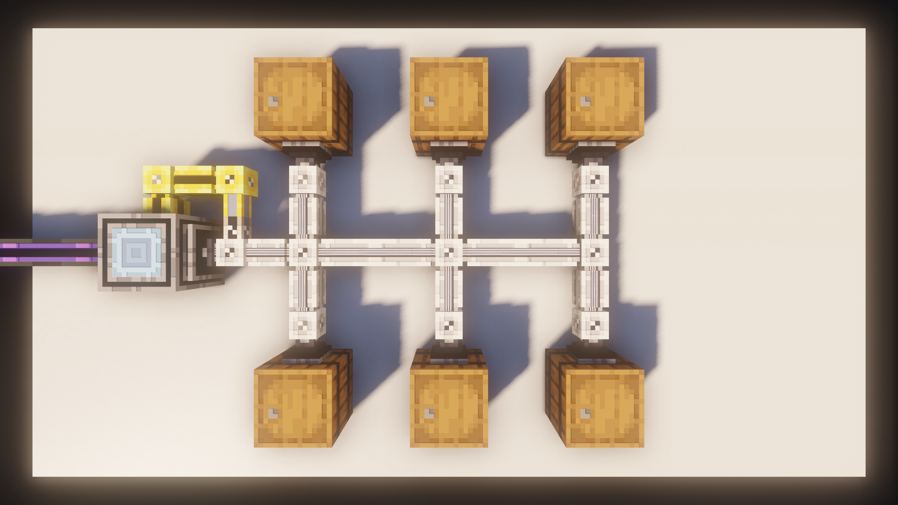
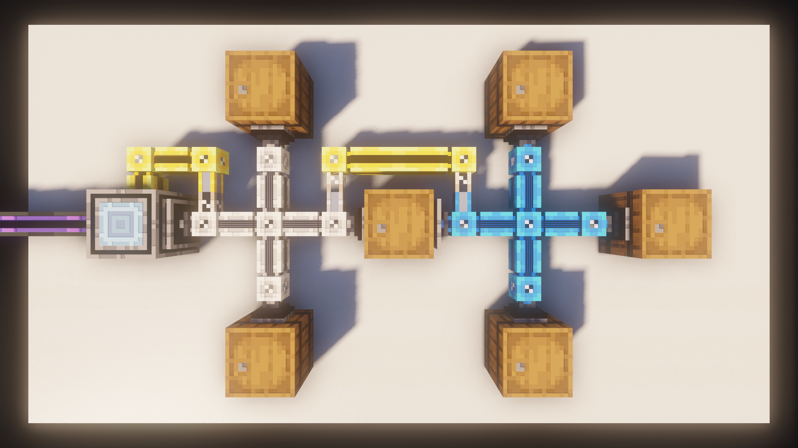
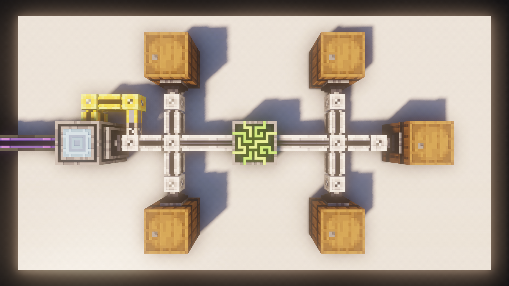

# Subnets

This Chapter will explain **Subnets**, how to best use them and why they're so **essential**.

---

## Making a Subnet

A Subnet is simply an **independent** network that can still communicate with your main net, but doesn't take any channels from it.
The easiest way to make such a network, is placing a **Storage Bus** against an **Interface**.

This way, the **Storage Bus** can read all the contents of the network the **Interface** belongs to as well as insert or extract items.

---

## Using a Subnet

What a Subnet does, is **reducing** the number of channels you use on your main net.

Instead of having to use **6 Channels** for **6 Import Buses**, you only use **1 Channel** for the **Interface**, while the **Import Buses** are in a **Subnet**.

!!! info "Power transfer"
    Subnets do **not** transfer power, which is why there is the **Yellow Cable** with a **Quartz Fiber** attached.

---

## Nested Subnets

You can nest Subnets as deep as you like. There is no limit to how deep you can go.

---

## Subnets with a Controller

You can have a **Controller** in your Subnet without any issues. Since there is no actual connection to your main net, you won't get a Controller conflict.

> Applied Energistics 2 | [CurseForge](https://legacy.curseforge.com/minecraft/mc-mods/applied-energistics-2)
